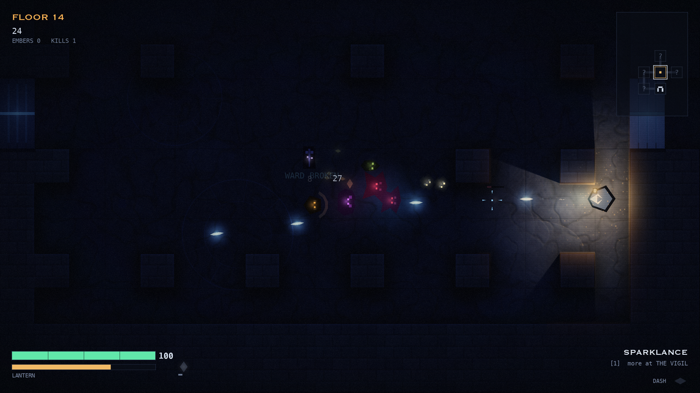
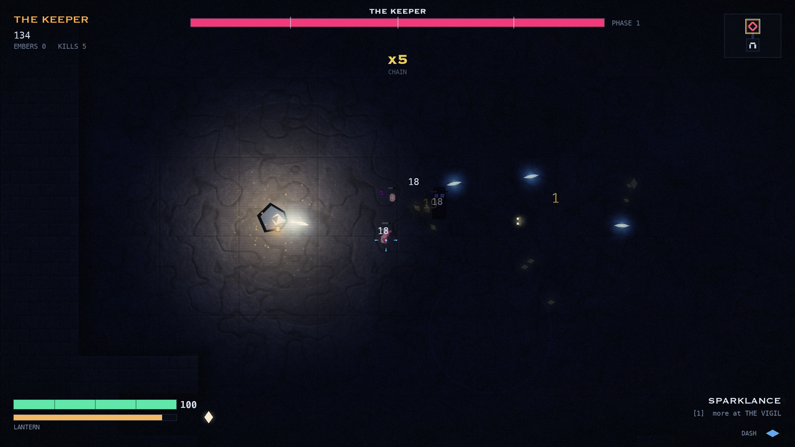
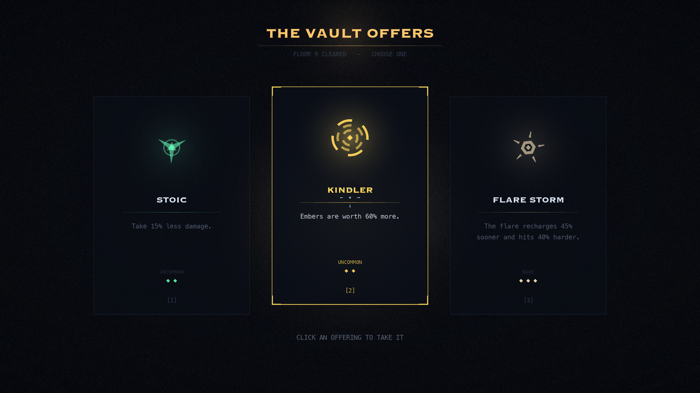

# LUMEN — Descent into the Vault

A top-down roguelite built on the CMU CS Academy graphics library
(`cmu-graphics`). Twelve procedurally generated chambers across six layout
archetypes, five enemy species and a three-phase boss, three weapons,
twenty-seven run modifiers, and real-time 2D shadowcasting — **you carry the
only light**, and everything you cannot see is still there.

No asset files ship with the game. Every texture, sprite, glow and item icon,
and all 21 sound effects, are generated at startup from numpy and PIL.

It runs on three renderers behind one interface — cmu-graphics' own
rasteriser, SDL's renderer, and OpenGL. On the last of those the lighting is
deferred and runs in float: analytic lights, saturating shadow coverage,
per-pixel volumetrics, surface relief taken from the art's own shading, dust
in the air, and a filmic tone map. See [Deferred lighting](#deferred-lighting).



<p align="center">
  
  
</p>

---

## Running it

```bash
./run.sh
```

There are two front ends and three renderers, and they compose:

```bash
python main.py                     # cmu-graphics host
python native.py                   # host it directly on pygame
LUMEN_RENDERER=cpu  python main.py    # cmu-graphics' own rasteriser
LUMEN_RENDERER=gpu  python native.py  # SDL's renderer (default)
LUMEN_RENDERER=gl   python native.py  # OpenGL, with shaders and HDR
```

`main.py` is the original and is unchanged. `native.py` owns the loop
outright - see `lumen/host.py` for what that buys, and `lumen/gpu.py` for how
the renderer is chosen.

That creates a virtualenv on first launch, installs the dependencies, and
starts the game. It picks the newest suitable Python on `PATH`; override with
`PYTHON=/path/to/python ./run.sh`. To do it by hand:

```bash
python3.12 -m venv .venv && .venv/bin/pip install -r requirements.txt && .venv/bin/python main.py
```

`pygame-ce` is pinned to 2.5.2 or newer even though `cmu-graphics` pulls it in
anyway: the GPU renderer needs `pygame.Window`, its `allow_high_dpi` flag, and
`Renderer.compose_custom_blend_mode`, all of which arrived in that release.
Without them the game still runs, but falls back to `cmu-graphics`' own CPU
rasteriser - which gives up native resolution and about two thirds of the
frame rate.

**Python 3.11–3.14 is required** — `cmu-graphics` 2.x does not support 3.10 or
earlier, and the system Python on macOS is 3.9. Run it from a real terminal:
`cmu-graphics` starts an interactive console thread on stdin and shuts the app
down when that stdin reaches EOF, so launching from a non-interactive shell
exits immediately.

## Controls

| Input | Action |
| --- | --- |
| `W A S D` / arrows | Move |
| Mouse | Aim |
| Left click / `J` | Fire (hold to charge the Coilbeam) |
| `Space` / `K` | Dash — brief invulnerability |
| `Shift` / `L` | Lantern flare — damages and shoves everything nearby |
| `1` `2` `3` / `Tab` | Switch weapon |
| `Esc` / `P` | Pause |
| `F` / `F11` | Toggle fullscreen |

Menus and the upgrade draft are mouse-driven too — hover to select, click to
confirm. The system cursor is hidden; the in-game crosshair is the cursor.

Clear a chamber and a rift opens; stand in it to descend and take one of three
offerings. Floors 6 and 12 belong to the Hollow Choir.

## The lantern

The lantern burns fuel continuously. As it empties its reach collapses toward a
minimum — it never goes out completely, but you will be fighting nearly blind.
Oil refills it, and braziers you light stay lit and refuel you while you stand
in them, which makes them worth holding ground for.

Enemies outside the light draw as nothing but eye-glints.

---

## How it is built

The interesting problem here is that `cmu-graphics` is a teaching library, not
a game engine. Everything below was measured on version 2.0.1 (whose renderer
is a compiled Rust rasteriser, `wyvern`) rather than assumed — and several of
the measurements were surprising enough to change the design.

**Measure the whole frame, not the callback.** `redrawAll` only *constructs*
shapes; the framework rasterises the tree, converts the buffer and blits it
after the callback returns. Timing inside `redrawAll` reported 3.4 ms while the
real frame was 22.8 ms. Every number here is full-frame.

| Operation | Cost |
| --- | --- |
| `drawRect` / `drawPolygon` | ~12 µs to build, ~4 µs to rasterise |
| `drawCircle` | ~36 µs to build — avoided in hot loops |
| `drawLine` | ~22 µs — a rotated quad, pricier than it looks |
| `drawLabel` | ~35 µs, plus several font-face selections inside the library |
| full-screen image, opaque | 0.15 ms |
| full-screen image, translucent | 0.29 ms |
| **the same image at a fractional offset** | **2.42 ms** |
| **the framework's final present, as `RGBA`** | **5.6 ms** |
| the same present, as `RGBX` | 0.45 ms |

The last two rows were where most of the frame went, and neither is obvious:

* **Images must land on whole pixels.** At a fractional destination the
  renderer falls back to a resampling path and a chamber layer costs ~15×
  more. The camera snaps to integers (`Camera.ox`), as does every image
  destination. 20.3 ms → 14.4 ms, and the baked stone stopped shimmering.
* **The frame is presented with a redundant alpha blend.** cmu-graphics hands
  its finished buffer to pygame as an `'RGBA'` surface, which makes SDL take
  the per-pixel blend path — but the buffer is fully opaque, because the
  framework's own first act each frame is to fill it with the background
  colour. Asking for the same bytes as `'RGBX'` is pixel-identical and
  12× faster. `lumen/runtime.py` installs that as a narrow, self-verifying
  shim: it proves on the live display that the two paths produce identical
  pixels before enabling itself.

The rest follows from the same table:

* **Anything static, soft, or large is an image, not shapes.** A chamber's
  floor, walls and minimap are baked at generation time. The vignette,
  scanlines and grain are composited into a *single* overlay sprite. Static
  text — HUD labels, the help pages, and repeated damage numbers — is baked
  once and blitted.
* **Nothing is rasterised during a frame.** Every lantern size a run can reach
  is baked while the screen is behind a floor-transition fade; a sprite built
  mid-frame is a 4–7 ms stall, and a lantern flare sweeping down through
  unbaked sizes was doing exactly that.
* **Circles and lines are avoided in hot loops.** Particles, projectiles and
  enemy bodies are polygons; the crawler's four animated legs are part of its
  body silhouette rather than four `drawLine` calls.

The game reads the display's refresh rate and targets it. Measured in the real
window on a 120 Hz panel, floor 1, the busiest floor (seventeen enemies, ~170
particles) and the boss arena all sit at **8.33 ms — a locked 120 fps**, with
p95 around 9.2 ms. Headless, with the present cost removed, the same scenes run
at 130–220 fps.

### Real-time 2D shadowcasting

The lantern casts a true visibility polygon. Rays are fired at every wall
corner within reach — plus a hair either side of each, which is what lets a ray
slip past a corner and define the shadow's edge — along with a ring of filler
angles so unobstructed light still resolves as a smooth arc.

The whole sweep is **one batched numpy expression**: a (rays × segments) matrix
of ray/segment intersections. A chamber with ~100 wall segments and ~50 corners
in range resolves in **0.03 ms**, which is what makes it affordable every frame
in Python.

Rendering it took three non-obvious steps:

1. Layering shrunken copies of the visibility polygon — the obvious approach —
   bands visibly, because every layer boundary is a hard polygon edge. Instead
   the falloff comes from one radial sprite whose alpha sums three power terms
   (hot core, usable pool, long tail), and the *occlusion* is drawn on top.
2. Those occluded regions are drawn as **merged bands**, not one quad per ray.
   A run of consecutive blocked rays is one continuous shadow, so it becomes a
   single polygon: in along the visibility boundary, back out along the rim.
3. Shadows are filled **opaquely**. Washing a translucent dark polygon over the
   glow only removes its own percentage of the light: at 52% opacity, half the
   lantern bled straight through walls into the corridor beyond. Filling with a
   colour just under the unlit floor tone at full opacity removes it entirely —
   measured by rendering each frame twice, once with the lantern suppressed,
   and diffing the occluded region.

Enemy visibility uses the same machinery: one batched line-of-sight test for
every enemy at once (`lighting.visible_points`), ~0.02 ms for two dozen.

### Resolution and scaling

The window is resizable, `F` toggles fullscreen, and a **DISPLAY** setting on
the title screen picks how sharp the game draws. Both are remembered between
runs. The game is authored against a 720-unit-tall view; `lumen/draw.py`
multiplies every coordinate on its way into the drawing call and `art`
rasterises every sprite at the matching pixel size, so the framing is identical
at any resolution while the pixels are real.

The obvious way to do this is one scale matrix on the canvas, and it is a trap:
the renderer takes a resampling path for every image and every fill while a
transform is active. Measured, 1280x720 -> **1282x722** — 0.3% more pixels —
took the frame from 8.4 ms to 15.4 ms. Scaling the coordinates instead leaves
the canvas at identity and costs almost nothing.

One detail matters as much as the rest of it: **multiplying integer design
coordinates by a fractional scale lands every image on a fractional pixel**,
which is the same 15x-slower blit path described above. `draw.drawImage` rounds
its destination. Without that rounding the whole approach measured *worse* than
the transform it replaced (23.8 ms); with it, 8.6 ms.

#### Reaching the display's real pixels

`pygame.display.set_mode` cannot ask SDL for `SDL_WINDOW_ALLOW_HIGHDPI`: it
filters the flag out. Without it SDL sizes the framebuffer in *points*, so a
1800x1169 fullscreen window on a Retina Mac gets an 1800x1169 buffer that the
compositor then stretches over 3024x1964 physical pixels — every edge blurred
across 1.7 pixels, which is what the game used to look like.

`pygame.Window` does expose the flag, so `lumen/runtime.py` takes the window
over: on the first frame the framework's window is destroyed and replaced with
an equivalent high-DPI one, and cmu-graphics is pointed at the new buffer.
That turns the same fullscreen window into a **3600x2260** framebuffer — the
one a native Mac app draws into, and the one the compositor samples back down
to the panel.

It matters twice over, because **the renderer does not antialias polygon
edges** — text is antialiased, vector shapes get one blended pixel of constant
weight. Drawing into a 2x buffer that the compositor downsamples *is* 2x2
supersampling, so the same code comes out both sharper and visibly smoother.
There is no antialiasing switch to turn on; resolution is the antialiasing.

Two things stop working once we own the window rather than `pygame.display`:
`display.flip()` and `display.get_surface()` raise *Display mode not set*, and
`get_current_refresh_rate()` raises *No open window*. Each gets a shim.

#### Two renderers

cmu-graphics rasterises on one core, and above cache size that is bound by
memory bandwidth, not by anything clever: at 3600x2260 a frame touches a 32 MB
buffer about eight times over — background fill, light, floor, walls, overlay,
the BGRA→RGBA conversion, the blit, the present — which is ~55 GB/s at 120 Hz
and roughly three times what one core delivers. A busy chamber costs about
**3.9 ms of resolution-independent shape construction plus ~2 ms per
megapixel**, so a 120 Hz budget of 8.3 ms buys about 1.9 megapixels against a
native framebuffer of 8.1. No setting on that renderer is both native and
120 Hz, and none can be.

So there is a second one. `lumen/gpu.py` issues the same drawing to SDL's
renderer, and because every module already drew through `lumen/draw.py`,
nothing else in the game changed:

| Fullscreen, 3600 x 2260 | cmu-graphics | GPU |
| --- | --- | --- |
| Frame, floor 1 | 24.1 ms — 41 fps | **8.2 ms — 122 fps** |
| Frame, boss floor | 24.9 ms — 40 fps | **8.3 ms — 120 fps** |
| CPU issuing the drawing | 2.5–3.6 ms | **0.8–1.8 ms** |
| Peak RSS | 3.32 GB | 3.34 GB |

The GPU is nowhere near its limit: a synthetic frame with 6000 sprites, 800
light wedges and three chamber-sized layers — about forty times what the game
actually draws — still held the vsync period. `LUMEN_RENDERER=cpu` selects the
old path, which is what the DISPLAY dial is for.

Three details are load-bearing. **Sprites are premultiplied**, because that is
how cmu-graphics composites, so textures use a blend mode composed to
`src + dst*(1-srcA)`; fading one needs a colour modulation *and* an alpha
modulation, since SDL's alpha mod scales only the alpha channel. **Geometry is
not** premultiplied — `draw_color` is straight RGBA under ordinary blending,
which is what `opacity` already meant. And **the game draws concave polygons**
(the star-bodied enemies), while `fill_triangle` takes triangles, so anything
not convex is ear-clipped first.

#### Never present a frame you did not draw

The framework decides whether to repaint from `had_event`, but only *some*
events reach a handler that repaints. A `MOUSEMOTION` is routed to
`onMouseMove`, which this game does not define, so `callUserFn` returns without
triggering a redraw - and the loop then calls `redrawAll` anyway. On the
cmu-graphics path that harmlessly re-blitted the same correct pixels. On the
GPU it presents whatever the swap chain hands back: a buffer two or three
frames old, or an uninitialised one. The result was a black flash every time
the pointer moved - while walking and aiming, and while moving the cursor
around the menu.

The present hook now returns without presenting when nothing has been drawn
since the last one, so the previous frame simply stays up. `MOUSEMOTION` is
also blocked again after the window is replaced (replacing it resets SDL's
event filters, which quietly undid the block set up at startup), but that is
only the optimisation - the guard is the fix, and it holds with the block
lifted and motion events flooding the queue.

#### Smooth motion

Two things were quantising the world to whole *design units* - about three
physical pixels at native scale - because the cmu-graphics renderer blits ~15x
faster to an integer destination: the camera offset (`fx.Camera.ox`) and the
lantern glow's position (`art.draw_lantern`). On the GPU that is exactly wrong.
Sampling between texels is free there, so snapping made the ground lurch in
steps while the player, drawn at exact coordinates, moved smoothly - measured,
the lantern's centroid moved *backwards* on some frames while walking forwards.
At 120 fps it read as the whole screen juddering. The GPU path now places
images at sub-pixel destinations with linear filtering, and the camera returns
exact offsets; the cmu-graphics path keeps the integer alignment it needs.

#### Light on masonry

A lit brazier gets the same treatment - its edges are resolved once on ignition,
since it and the walls are all static, so it can afford the subdivision too.
Lighting whole edges at one strength left a bright block on the wall with hard
edges where the block ended.

`lighting.lit_wall_segments` cuts each lit wall edge into pieces and evaluates
the falloff at every piece's midpoint, so an edge running away from the lantern
darkens as it goes instead of lighting up uniformly. `palette.wall_light` then
maps that strength to a colour ramp - near-white beside the flame, through the
lantern's amber, to a dull ember at its reach - so the falloff is carried by
the colour and not just by the opacity.

On the GPU each piece is drawn as a spill onto the floor in front, the lit rim
itself, four dimmer strokes carrying the light back *across* the stone face,
and a hot filament where the wall is close and square-on. Both directions have
to be fine enough to disappear: a piece is a flat-coloured quad, so too few
along the edge and the light reads as a row of bricks rather than a glow, and
the wash strokes must overlap or the gap between two of them draws a dark line
down the wall. Pieces share their endpoints exactly, so they tile with neither
gaps nor doubled seams. That is what stops
the lantern reading as a thin outline around a block. It costs a few hundred
extra quads a frame, which is why it only exists on the GPU path - the same
thing on cmu-graphics would be several milliseconds of `drawLine`, so that path
keeps its single flat stroke (with the new colour ramp, which is free).

#### Shadows are ribbons, not outlines

A cast shadow is built as a run of blocked rays: in along the visibility
boundary, back out along the light's rim. Merging that into one closed polygon
is what makes it affordable on cmu-graphics, which charges ~35 us a shape - a
pillar-heavy chamber emitting 120 separate quads spent ~4 ms a frame on shadows
alone.

The merge has a cost of its own. Audited over 19,541 real bands, **104 of those
outlines cross themselves** around a concave corner and a further **344 enclose
the wrong area - by up to 124%**. A triangulator that assumes a simple polygon
then fills the wrong region, which is what painted black wedges across lit floor
at the inside corners of a room.

On the GPU there is no reason to merge: `shadow_ribbons` hands back the two
chains and the shadow is drawn as the strip between them, one quad per ray step.
Every quad is its own small convex polygon, so there is nothing to infer and
nothing to get wrong. Quads go straight to `fill_quad`, which skips both the
triangulation and half the draw calls - without that the extra shapes pushed the
95th-percentile frame from 9.0 ms to 11.7 ms.

`tools/blend_check.py` draws a ladder of opacities with both renderers and
compares the pixels: they agree to within one step of rounding on flat fills,
layered translucency and premultiplied sprites alike.
`tools/compare_backends.py` renders the same seeded frame with each and stacks
them for eyeballing. They are not meant to be identical — the library does not
antialias polygon edges and the GPU does, and text is baked with PIL on one
path and rasterised by the library on the other.

#### The dial

DISPLAY works on both renderers. Where it starts depends on which one is live:
on the GPU every rung holds 120 fps, so there is nothing to buy by rendering
below **NATIVE** and it starts there; on cmu-graphics native costs 40 fps and
neither end is a good first impression, so it starts on **BALANCED**. Touch the
dial once and the choice is remembered instead. On cmu-graphics it is a real
trade:

| DISPLAY | Fullscreen render size | cmu-graphics |
| --- | --- | --- |
| NATIVE | 3600 x 2260 | 24.7 ms — 40 fps |
| HIGH | 3024 x 1898 | 21.1 ms — 48 fps |
| BALANCED | 2592 x 1626 | 17.0 ms — 59 fps |
| SMOOTH | 2232 x 1400 | 13.5 ms — 74 fps |
| FAST | 1800 x 1130 | 9.5 ms — 105 fps |
| FASTEST | 1440 x 904 | 8.2 ms — 123 fps |

**AUTO** chooses for you — it measures real frame periods, splits them into the
part that scales with pixels and the part that does not, and predicts which
rung fits the display's refresh rate. It moves in one jump rather than
stepping, because every change re-bakes every sprite at the new size (~200 ms),
and it only applies a change where that cannot be felt: while the screen is
black between floors, in a menu, or — if a floor is running badly enough to be
worth one hitch — mid-play, downwards only.

Below full scale the cmu-graphics path draws into a smaller buffer that an SDL
renderer stretches, because the GPU scales for free where
`transform.smoothscale` costs 4-5 ms; the GPU path uses SDL's logical size for
the same thing. `SDL_RENDER_SCALE_QUALITY` must be set to `1` explicitly or
the upscale is nearest-neighbour and blocky, and a logical size has to come
*off* before `Renderer.to_surface()` or the read is a segfault rather than an
error. A window can be in surface mode *or* owned by a renderer, never both —
asking a surface-mode window for a renderer fails with *Surface already
associated with window* — so changing between them means rebuilding the window,
as does changing the high-DPI flag.

Two macOS notes. `pygame.display.list_modes()` advertises the panel's raw pixel
modes, but requesting one fails with `CGDisplaySwitchToMode(): Unknown Error`
*and* leaves the display half-reconfigured, so fullscreen asks for borderless
desktop; and `set_video_mode` trusts the resulting surface rather than the
call's return value, because pygame can raise and still have changed the mode.
`FULLSCREEN | SCALED` was tried and is slower than rendering at full size —
SDL's scaler is on the CPU there.

#### Sprites belong to a render scale

Changing the dial changes the render scale, and `art.set_scale` empties the
sprite cache and *releases the pixels* of everything in it. Anything holding a
baked sprite across that has to rebuild it in its `resize`, or it is left with
an empty husk that raises on the next frame that draws it. That was a real
crash: the title screen's logo was baked once in `__init__`, so changing
resolution on the title screen killed the app. `tools/playtest.py` has
`resize-title`, `resize-help` and `resize-play` scenarios to keep it fixed.

### Deferred lighting

`LUMEN_RENDERER=gl` swaps SDL's fixed-function renderer for OpenGL with real
shaders and float16 render targets, and the whole lighting model changes with
it. Nothing is drawn lit. Everything solid goes into a **scene** buffer at its
own unlit colour, every light goes into a **light** buffer, and the composite
multiplies the two. That is what makes an enemy fade up as the lantern reaches
it instead of popping on when a visibility test flips, and what lets masonry
catch light without a rim stroke painted along each edge by hand.

Because the targets are float, a light is allowed to be brighter than the
screen. An ACES filmic curve brings the result back down at the end, so the
flame at the centre of the lantern rolls off instead of clipping to a white
slab, and the hand-dimmed emissives the 8-bit path needed are gone.

**Lights are maths, not pictures.** A glow used to be a radial ramp baked into
8-bit RGBA and stretched to whatever radius the lantern currently had, which
quantises the profile at the source and then resamples it. It is evaluated per
pixel now, from the pixel's own distance to the light. But the screen is still
eight bits, and a falloff that crosses a level every few pixels contours no
matter how exact the buffer feeding it is — so triangular sub-level noise goes
in just before the hardware rounds. Measured over the part of the radius that
is actually a gradient, 11.8% of it fell in flat 8-bit bands; with the dither,
0.0%. (Worth recording: the analytic curve made banding *worse* on its own.
The baked sprite's own dither had been breaking contours up by accident.)

**Occlusion does not compound.** Shadows were multiplied straight into the
light buffer, three offset copies per occluder for the penumbra — right for
one occluder and wrong for two, because where two shadows crossed the multiply
compounded. Counting coverage per pixel found 0.52% of a frame taking four to
six passes instead of three: `0.41**6` against an intended `0.41**3`, fourteen
times too dark, and clearly visible as a black wedge running out of every
corner where two shadows met. Coverage is collected in its own buffer now, one
offset pass per colour channel under MAX blending, and the light is multiplied
down once by the shade raised to the number of passes that reached the pixel.
Two overlapping shadows now measure 1.0000x the darkness of one.

**Every light that stands still casts one.** Only the lantern was ever worth a
visibility sweep per frame, so braziers and the rift shone straight through
masonry. Neither of them moves and neither do the walls, so their sweep is
cast once and kept, and the light is drawn as one triangle per ray with the
falloff evaluated per pixel — the same thing the volumetric shafts do.

> A sweep hands its rays back sorted from angle zero, so a fan drawn as
> `range(len(points) - 1)` leaves the wedge that straddles zero undrawn: a
> hard-edged bite out of the light on the right-hand side of every static
> light in the game. Sweeping the light's own brightness by angle finds it as
> a single dark sector at exactly +0°.

**The shafts** fill the visibility fan so the lit cone squeezes through a
doorway with the light. On the SDL path that is forty concentric bands of
quads per ray, which cost 3.3 ms of a 9.3 ms frame and still banded, because
each band carries a single integer opacity over a profile spanning about eight
of them. Here it is one triangle per ray. A fortieth of the geometry, and
continuous rather than in eight steps.

**Surfaces have shape, and every light finds it separately.** The stone was
drawn as if lit from nowhere in particular, which means its own light and dark
already describe its relief — so a normal map is derived from the luminance of
each stone layer as it is baked. The N·L is then evaluated **per light, in the
glow shader**: a glow's vertices already carry the offset from the light in
units of its own radius, so the direction back to the flame is just that
negated, and one more term carries how high the light hangs. The ratio is
taken against what a flat surface at the same spot would receive, so unshaped
ground comes back at exactly 1.0 and the exposure of the room does not move
with it.

That per-light part matters more than it sounds. A single key light means
every light rakes the stone from the same direction, which is the one
arrangement guaranteed to look wrong the moment there are two of them.
Measured with two lights of equal radius placed on opposite sides of the same
patch of floor, the raking patterns correlate at **−0.149** — anti-correlated,
as two real lights would be. A shared key light gives +1.000.

Each light carries its own height, and they differ: a carried lantern at about
a third of a tile, a brazier's bowl higher, the rift at very nearly floor level
because it *is* the floor. Dust and bolts pass a height of zero and opt out —
neither is lying on anything.

Anything standing on the ground writes a flat normal of its own into that
buffer first, or every light in the room would rake a person with the courses
of the stone underneath them, which is the floor's texture printed across a
figure.

**Walls have a side.** A wall used to be a lid — a top face with a line drawn
round it. The bottom of each footprint is now given over to the one side a
top-down camera can see, and its normal points *down-screen* rather than up, so
it takes light from a completely different direction than the top does. The
light lying along a wall is aimed at that geometry: its brightest line sits on
the arris where the face meets the top, with the face falling away in front of
it and the top reaching about a tile back. Landing that line on the wall's
outer edge instead — where it was before the face existed — painted a flat warm
stripe across the one surface the shading had just worked out.

**A lit floor is mostly not floor.** Measured in a pool, two thirds of what
you see there is light added over the stone rather than the stone itself.
That term is why a lit floor reads as lit instead of merely visible — but the
same amount was added over everything else, and a figure whose whole design is
a near-black silhouette has almost no albedo to compete with it. The player
came out as a warm haze in the shape of a person, with the floor's carving
legible through it. The scene buffer's alpha was carrying nothing, so it
carries **coverage**: the room leaves it alone, things standing in the room
set it, and the composite holds the added light back to a tenth where it is
set. The lit floor moves by about a level; a washed-out cloak edge drops
forty-four.

> One trap worth writing down: moderngl applies a framebuffer's colour mask
> when the framebuffer is **bound**, not when it is set. Set the mask, draw
> without rebinding, and alpha is written anyway.

**Dust** hangs in the air in world space and is drawn into the albedo, not the
light — so a mote is a bright speck of nothing and the lighting decides
whether you can see it. In the dark there is no dust; walk the lantern into a
room and the air fills. Seven thousand of them, built with numpy and handed to
the batch as bytes, because a Python-level call per mote is the entire cost.

**Burns** left by explosions write to both the albedo and the normal buffer,
so a scorch mark has a hollow in it and catches the lantern like everything
else does.

**At the end**: a bright pass, a bloom chain folded back with a tent filter,
an anamorphic streak (a lantern in the dark is the brightest thing on screen
by a wide margin, and a symmetric halo reads as a glow effect rather than as a
very bright object), and a split-tone grade — shadows toward slate, highlights
toward amber. The distance between those two is the mood.

In play at 1800x1120 this holds about 120 fps, with roughly a third of the
frame left over.

### Pathfinding

Steering straight at the player is what made enemies press into walls and
embers stall behind pillars. `lumen/flow.py` runs one breadth-first sweep over
the chamber's open tiles, giving every tile a distance-to-player; anything that
wants to reach you walks downhill. Line of sight still wins when it exists —
following the tile field in the open makes movement visibly snap to the grid —
so the field only takes over when the player is actually hidden.

It is rebuilt only when the player crosses into a new tile, a couple of times a
second, and a whole chamber resolves in **0.16 ms**, so it is far cheaper than
per-agent path search. Dropped enemies pick their way around corners, and
embers route around walls to reach you.

### Two library quirks worth knowing

Both cost real debugging time and are documented in the code:

1. **Images must be premultiplied.** `cmu-graphics` hands image bytes to its
   renderer untouched, and that renderer composites premultiplied alpha.
   Feeding it ordinary straight-alpha data makes every translucent pixel render
   at full strength — a 5 %-alpha white grain overlay comes out as solid white
   noise. `art.premultiply` handles it (and skips the work for opaque images,
   which saves ~17 ms per chamber bake).
2. **PIL only alpha-blends onto RGB.** `ImageDraw.Draw(img, 'RGBA')` blends when
   the target is RGB and *replaces* when the target is RGBA, so drawing
   translucent detail straight onto an RGBA canvas punches holes instead of
   shading. Both baked layers are composed in RGB and given their alpha at the
   end.

Also: `opacity` outside 0–100 raises rather than clamping, which is a hard
crash mid-frame, so computed opacities go through `mathx.opacity`. And
`from cmu_graphics import *` shadows `random`, `round`, `print` and — painfully
— PIL's `Image`, so this codebase always imports the drawing functions by name.

### Procedural sound

`cmu-graphics`' `Sound` can only load a file, so `lumen/audio.py` synthesises
21 effects with numpy at first run and writes them to a small WAV cache beside
the game. Each effect gets a pool of voices, because `Sound.play()` reuses one
channel per sound — without that, rapid fire retriggers a single channel and
stutters instead of overlapping.

The first version of these was built from raw square and saw waves and bare
sine tones at musical intervals, all of it dry, and it sounded like a machine
rather than like a vault. Sound cannot be checked by looking at it, so
`tools/sound_report.py` measures the qualities that were wrong — where the
energy sits, how much of it is above 4 kHz, the ratio of odd to even harmonics
(a pure tone or a square wave has almost no even harmonics, which is the
chiptune signature), and how long each effect rings after its peak.

Three changes, measured across all 21 effects:

| | before | after |
| --- | --- | --- |
| Spectral centroid | 841 Hz | **438 Hz** |
| Energy above 4 kHz | 2.2% | **0.2%** |
| Tail to −40 dB | 0.44 s | **0.62 s** |

*Filtering that actually filters.* `_lowpass_fast` is a box average rolling off
at 6 dB/octave, so a "filtered" square kept most of its buzz. `_filter` shapes
the spectrum directly with an FFT, which is both cleaner and faster than
looping a one-pole filter in Python.

*A room.* `_room` convolves each effect with a synthesised impulse response —
decaying filtered noise behind a few early reflections — so a shot has
somewhere to go. This is most of why the set now sounds like it is happening
somewhere.

*Struck bodies, not tones.* Picking something up was two sine waves a fifth
apart, which measured as having no even-harmonic content at all. `_struck`
rings a set of *inharmonic* partials with the higher ones dying first, which
is what stone and glass and metal actually do.

`ui_move` is deliberately untouched: it is a 40 ms tick, it already sat right
under the eye, and a tail on it would only smear the menu.

#### Every shot a different shot

One recording per effect means forty shots in a row are forty identical
waveforms, which is most of what makes repeated fire sound mechanical. Each
effect is now baked into several *takes* at slightly different pitch and
colour — six for the ones you hear constantly, one for `ui_move`, which wants
to be the same tick every time — and a play picks one at random. Measured, the
six takes of `shoot` span 18.6% in pitch and the closest two differ by 0.36 in
mean amplitude.

Channels come from a pool rather than one per sound. `find_channel(True)` takes
a free one or steals the oldest, which is simpler than hand-sized voice pools
and stays correct now that tails are three times longer.

And a sound happens *somewhere*. `audio.set_listener` is told where the view is
once a tick, so a call site only has to know its own position:

```python
audio.play_at('crit', self.x, self.y, 0.5)
```

which pans it by how far it is from the middle of the frame, drops its volume
with distance, and does not play it at all past the edge of earshot — so an
enemy dying off-screen is something you notice rather than something that
startles you at full volume. Panning is constant-power, so crossing the centre
does not dip.

---

## Layout

```
main.py              entry point — binds cmu-graphics handlers to Game
native.py            entry point — hosts the same Game directly on pygame
lumen/
  app.py             top-level state machine (title, run, draft, endings)
  world.py           one floor: simulation and world rendering
  lighting.py        numpy shadowcasting — visibility fans and LOS tests
  flow.py            breadth-first distance field: enemy and pickup pathing
  runtime.py         host-level tuning of the framework's present path
  host.py            the native pygame loop: fixed timestep, no framework
  gpu.py             picks a renderer at import; the rest of the game asks it
  glx.py             OpenGL backend — shaders, float16 targets, the pipeline
  sdlx.py            SDL backend — textured quads and fixed-function blending
  motes.py           the dust field
  level.py           chamber generation, collision, baked floor/wall images
  art.py             procedural sprites, textures, and baked text
  noise.py           vectorised value noise / fbm
  player.py          movement, dash, aiming, the lantern
  enemies.py         five species, their AI and their silhouettes
  boss.py            the Hollow Choir
  projectiles.py     pooled projectiles and the three weapons
  particles.py       pooled particle system
  fx.py              camera, shake, hit-stop, floating text, transient lights
  pickups.py         embers, oil, mercy
  upgrades.py        the 27 run modifiers
  hud.py             heads-up display and minimap
  screens.py         title, help, draft, pause, endings
  audio.py           numpy sound synthesis and the WAV cache
  save.py            persistent records
  config.py          all tuning constants
tools/
  playtest.py        headless driver: scripted input, autopilot, screenshots
  gpu_smoke.py       drives the GPU path under the native host, on either
                     backend — the branches playtest structurally cannot reach
  shoot.py           generic harness for prototyping a scene in isolation
```

## Development

The game can be driven headlessly, with a fixed timestep and a pinned seed, so
runs are reproducible:

```bash
# Screenshot the title screen
.venv/bin/python tools/playtest.py --scenario title --out shots/title.png

# Let the autopilot play, starting on the boss floor
.venv/bin/python tools/playtest.py --scenario firstframe --auto --floor 6 \
    --frames 1100 --seed 31 --out shots/boss.png

# Stop and capture as soon as the upgrade draft appears
.venv/bin/python tools/playtest.py --scenario firstframe --auto \
    --stop-at draft --settle 30 --out shots/draft.png
```

`playtest.py` hosts the game inside cmu-graphics, where the renderer takeover
only ever reaches the SDL backend — so every branch behind `gpu.active()` on
the OpenGL path goes undrawn by the suite. `tools/gpu_smoke.py` runs the same
`Game` through `lumen/host.py` on a chosen backend and draws what the suite
cannot: braziers lit and mid-ignition, seen close and from across the floor,
across two resolution changes and both visual settings. It exits non-zero with
a traceback rather than skipping a frame.

```bash
.venv/bin/python tools/gpu_smoke.py --renderer gl
.venv/bin/python tools/gpu_smoke.py --renderer sdl
```

That gap was not hypothetical: a lit brazier went on referencing two constants
that had been deleted for weeks, and the first thing to notice was a player
walking into one.

Each run reports frame timings, peak draw-call drivers, and the slowest frames.
With a fixed timestep and a pinned seed, renders are **pixel-reproducible** -
two runs of the same scenario produce byte-identical frames - which is what
makes it possible to prove a rendering change did nothing, or to diff a frame
against the same frame with the lantern suppressed and measure light leaking
through a wall.

A few environment hooks help when you need the real window rather than the
headless harness:

| Variable | Effect |
| --- | --- |
| `LUMEN_DEBUG=1` | live frame/particle/enemy counters in-game |
| `LUMEN_SELFTEST=N` | quit after N frames and print the measured frame rate |
| `LUMEN_SELFTEST_PLAY=1` | start a run immediately, so the measurement covers gameplay |
| `LUMEN_SELFTEST_SHOT=path` | save a screenshot before quitting |
| `LUMEN_START_FLOOR=N` | begin a run partway down |
| `LUMEN_FPS=N` | override the detected refresh rate |
| `LUMEN_SEED=N`, `LUMEN_FIXED_DT=1` | make a run reproducible |
| `LUMEN_TRACE_ART=1` | log every sprite the game rasterises, with timings |
| `LUMEN_TRACE_FRAMES=180-200` | dump per-frame counters over a range |
| `LUMEN_SAVE=path` | redirect the save file, so tests never touch real records |

For example, to confirm the real window still holds 60 fps in combat:

```bash
CI=1 LUMEN_SELFTEST=300 LUMEN_SELFTEST_PLAY=1 .venv/bin/python main.py
```
