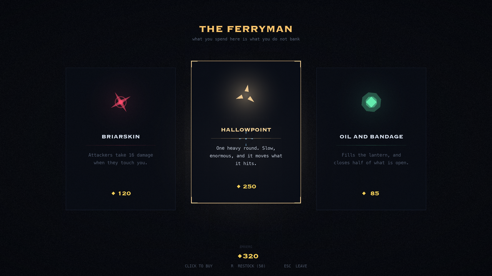
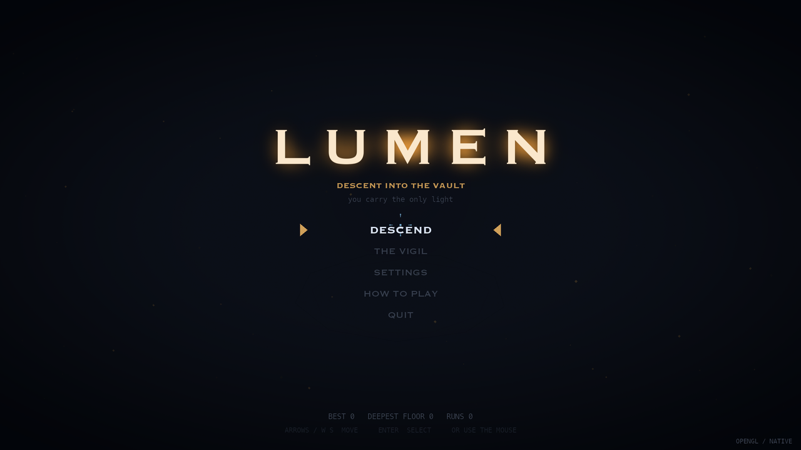
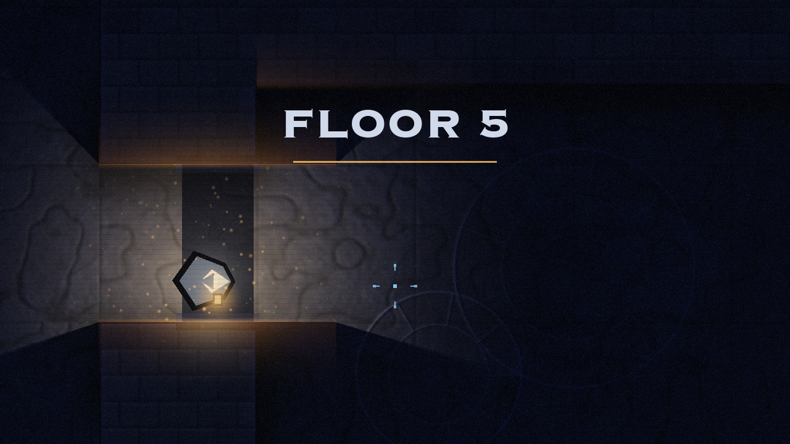
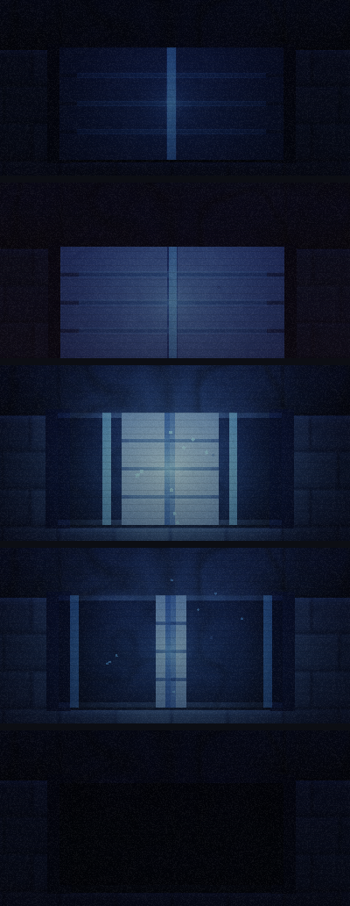

# LUMEN — Descent into the Vault

A top-down roguelite where **you carry the only light**. Twenty floors, each
a map of rooms you walk between; fifteen species that mostly want something to
do with your lantern; three bosses; six weapons; fifty-eight run modifiers and
a shop that spends the same embers your permanent progression does. Real-time
2D shadowcasting, deferred float lighting, and everything you cannot see is
still there.

No asset files ship with the game. Every texture, sprite, glow and item icon,
and all 83 sound effects, are generated at startup from numpy and PIL.


<p align="center">
  
  
</p>

---

## Running it

<p align="center"></p>

```bash
./run.sh
```

That creates a virtualenv on first launch, installs the dependencies, and
starts the game. It picks the newest suitable Python on `PATH`; override with
`PYTHON=/path/to/python ./run.sh`. To do it by hand:

```bash
python3.12 -m venv .venv && .venv/bin/pip install -r requirements.txt \
    && .venv/bin/python native.py
```

**Python 3.11+**, `pygame-ce` 2.5.2 or newer, and `moderngl`. There is one
renderer and it is OpenGL 3.3 core — see [One renderer](#one-renderer) for
what that replaced and why.

## Controls

| Input | Action |
| --- | --- |
| `W A S D` / arrows | Move |
| Mouse | Aim |
| Left click / `J` | Fire (hold to charge the Coilbeam) |
| `Space` / `K` | Dash — brief invulnerability |
| `Shift` / `L` | Lantern flare — damages and shoves everything nearby |
| `1` … `6` / `Tab` | Switch weapon (whichever you carry) |
| `R` | Redraw the offering, if you have a redraw |
| `Esc` / `P` | Pause, or back out of a screen |
| `F` / `F11` | Toggle fullscreen |

**Menus are the pointer's,** not the keyboard's. They used to be both, and the
two fought: `_hover` sets the selection from whatever the cursor is over,
every frame, so with the mouse resting anywhere near a list every key press
was immediately undone. One input or the other, and the one that already
worked is the pointer. `Esc` still backs out, because leaving a screen is not
choosing on it. The system cursor is hidden; the in-game crosshair is it.

Everything that changes how the game looks or sounds lives on a **Settings**
page rather than on the title screen — including **WALL LIGHT**, which keeps
the masonry lit whatever the lantern is doing, for players who would rather
read the room than be surprised by it.

The **floor map** sits in the corner and shows what you have seen: rooms you
have walked into, labelled with what they were, and the ones they open onto
as unmarked outlines. It is a record, not a floorplan handed to you at the
door.

---

## A floor is a map, not a room

A floor used to be one chamber with one wave in it. The bot cleared floor one
in six seconds, which meant the lantern's fuel — the game's only clock — never
had time to run down, and a run was twelve rooms in a row.

A floor is now four to fourteen rooms on a graph: a critical path from the
entrance to the way down, with branches hung off it that dead-end in
something worth having. The rule that makes it a game is that **the descent
opens the moment you reach it**. You never have to clear a floor. What you
leave behind is the price of going down early, and that only reads as a
choice if the way down is never withheld — so a floor is a budget of light
and health, and every branch is a wager against it.

| Room | What it is |
| --- | --- |
| ENTRANCE | Where you arrive. A lit brazier. Never hostile. |
| COMBAT | The staple. Seals behind you. |
| ELITE | One elite with an escort. Always drops. |
| CACHE | Embers, or a choice of relics. |
| SHOP | The Ferryman. |
| SHRINE | A pact: pay something real, take something real. |
| HEARTH | Full fuel, a little health, nothing in the room. Rare. |
| GAUNTLET | Optional, marked as such, and hard. |
| DESCENT | The rift. Open on arrival. |

### Walking through the door

<p align="center"></p>

A room change used to be a fade to black, a swap, and a fade back — three
quarters of a second in which the game stopped being a place, happening more
often than anything else in a run.

The two rooms are put in the same space instead. The neighbour's matching
doorway is aligned with the one being walked through, which makes the two
border walls coincide — one wall, one opening, as adjacent rooms ought to be.
From then until the player is through, both chambers are drawn, both are
solid, and both occlude the lantern: the visibility sweep is handed the union
of their edges, so light spills through the doorway into the room ahead.

The swap still happens; it happens *underneath* you. Crossing the threshold
shifts every coordinate in play — the player, the camera, its frame, loose
pickups, live particles — by the offset the neighbour was being drawn at.
Every number changes by a room's width and nothing moves on screen.

`tools/crossing_check.py` is what holds that claim up. It measures the
player's position *relative to the camera* frame by frame, and separately
asserts the raw rebase really did happen. A cut would be a thousand-pixel
step; the worst on-screen step is fifteen, and that is the camera panning as
the framing widens from one room to two.

Two things had to change underneath it. Doors are carved through the **whole**
wall now rather than through its inner ring only — a doorway had been an
alcove you could stand in and never pass through, which nobody noticed for as
long as walking through one teleported you past it. And the camera frames a
*region* rather than a size, easing between framings on a smoothstep: an
exponential lerp is fastest on its first frame, which read as a shove
followed by a drift.

### Doors

<p align="center"></p>

A doorway used to be a hole that was always open, always passable and always
transparent to light. Being sealed in was said with translucent blue bars
drawn across the hole — which read as neither state, and did nothing to the
light, so a "sealed" room lit the corridor beyond it exactly as brightly as
an open one.

A door is an object now, and it is a real occluder. Two leaves meet in the
middle and withdraw into the jambs; while they are out they collide **and**
cast shadow, both from the same rectangles, so the two can never disagree.
The lock is drawn *on* the leaves — a seam of cold light down the join, bars
struck across the face — because light hanging in an empty doorway has
nothing to be light on.

Clearing the room flares the seam, breaks the bars outward and slides the
leaves back over half a second, and because they are the occluders the room
beyond genuinely opens up to the lantern as they go. A hostile room seals
behind you on arrival, the door you came through included — which it could
not do before, because until you were through, that door had to stay open
for you.

## The lantern

The lantern burns fuel continuously. As it empties its reach collapses toward a
minimum — it never goes out completely, but you will be fighting nearly blind.
Oil refills it, and braziers you light stay lit and refuel you while you stand
in them, which makes them worth holding ground for.

Enemies outside the light draw as nothing but eye-glints.

---

## The run, and what outlasts it

<p align="center"></p>

**The offering.** Three cards between floors, from a pool of fifty-eight.
Half of
them raise a number, which is a foundation and not a design - three offerings
of "damage x1.22" is not a decision, and a run built from them plays like any
other. The other half either want a way of fighting or cost something:

* Conditional damage. NIGHT-FED pays against what is outside your light,
  AMBUSHER against anything still at full health, OVERCHARGE as the lantern
  empties, MOMENTUM while you are moving, BULWARK while you are not.
* SIPHON returns fuel on every kill, which turns the lantern from a clock
  running down into something killing wins back.
* DASH CLEAVE makes the dash a weapon; ARCLIGHT jumps hits between enemies.
* Five **pacts**, each of which costs something real: GLASS trades fragility
  for damage, BLOOD trades half your health for lifesteal, HOLLOW trades all
  healing for speed, GUTTERING trades a third of your light for fire rate,
  GREED trades fragility for embers.
* SECOND SIGHT buys redraws — the smallest thing that turns three fixed cards
  back into a choice.

Rarity tilts with depth, so the foundational things dominate early and the
run-defining ones get likelier further down: measured, rarity-1 upgrades are
26% of offers on floor one and 41% at the bottom. Without that, a build is
decided on floor one by whatever happened to come up.

**Wardens** carry a shield with its own health, and it narrows as it takes
damage until it gives way. It used to be a fixed arc that tracked you and
returned zero from the front, so the only answer was to walk around behind
something that was walking around to face you — an errand rather than a
fight. Shooting the front is now a real if slow option (about thirty
lance shots), flanking is a shortcut rather than the only door, and getting
behind one still reaches the body while the shield is up. It needs no health
bar, because the arc shrinking from 132° to 35° *is* the bar.

**Three bosses, and they ask different questions.** The Hollow Choir is met
first, on floor six: a slow mass that fills the room with bullets, so the
answer to it is footwork. The Snuffer waits on thirteen and is the opposite in
every direction that matters — fast, small, and it comes for the one resource
the whole game is built on. Its aura eats fuel, its signature attack smothers
the flame to a crawl, and its own light *shrinks* as it rages, so the fight
gets darker the closer it is to dying.

**The Keeper** is at the bottom, on floor twenty, and it has every lantern but
yours.

For nineteen floors light is the one safe thing in this game. That fight takes
it away by turning it round: the Keeper attacks *with* light. It brands the
floor with it, sweeps the room with it, carries a ring of stolen lanterns that
shield it and fire outward, and at the end gathers every scrap in the chamber
and throws the lot back at you. Its shadows are the only cover there is, which
is why its sanctum has pillars in it. And where the Snuffer's own light
shrinks as it rages, the Keeper's **grows** — the last phase of the last fight
is played in a room that is almost entirely lit, with almost nowhere left to
stand.

All three **arrive** rather than simply being there. Three beats, all built
out of light because that is the language the rest of the game speaks: the
room answers first with rings running outward, then the thing gathers out of
the dark with motes falling inward, then it opens its eye. The view swings
across to watch and comes back as it finishes — an arrival you cannot see is
not an arrival — and nothing takes control away from you while it happens.
They **come apart** the same way, and the way down does not open until it is
over.


### The bestiary

Fifteen species, introduced roughly one a floor for sixteen floors — so the
vault is still teaching you something new most of the way down. Floor one is
pure crawler; floor twenty holds all fifteen and crawlers are still 12% of
what spawns, because it should stay recognisably itself. A species' weight
decays with how long it has been legal, which is what stops act three looking
like act one with bigger numbers.

Three of them could not exist in a game with room lighting, and they are the
reason the roster was worth expanding at all:

* the **lurker** moves only while it is *unlit*. Your light is how you see it
  and also how you stop it, and you cannot point it everywhere — measured, it
  covers 305 px/s in the dark and 2 px/s in the light;
* the **pale** can only be hurt while it *is* lit, and takes 8% of a hit
  otherwise. It is the mirror of the lurker, and the reason both exist: a room
  holding the two cannot be solved by pointing the lantern one way and leaving
  it there. The flare is its natural answer;
* the **douser** takes fuel instead of health, and chokes the flame for
  seconds. The only thing in the vault that attacks the resource rather than
  the body.

The rest are the honest shapes a roster needs to function: a **bolter** that
telegraphs a charge across the room, a **keener** that mends whatever is
nearest you and never comes close itself, a **splitter** that becomes two
smaller ones, a **cinder** swarm that arrives as six, a **mirror** that sends
your own shots back as hostile fire, a **delver** that travels under the floor
and marks where it will surface, and a **carrion** that leaves a pool of
standing rot — which makes *where* you kill it a decision nothing else asks.

`tools/bestiary_check.py` holds each of them to the claim made for it: 29
checks, and every one of them is the specific behaviour rather than "it did
not crash".

### The Ferryman

Embers were a score that happened to be spendable *between* runs. They are
spendable during one now, at a shop with its own room, and the point of it is
a single decision made eight or nine times a descent: **spend it now, or bank
it for the Vigil.** One currency does that; two would let you have both and
decide nothing.

Nothing on his shelf is priced in embers. `tools/economy_report.py` counts
what a floor actually pays against the real spawn tables — 54 embers on floor
one, about 700 on floor nineteen — so a flat price list would be a mortgage
early and a rounding error late. Everything is priced as a share of the floor
it is standing on.

He stocks an offering always (it is the reason to stop), and rolls for a
restorative, a redraw, and a weapon the run is not carrying. That last one is
the interesting one: the Vigil unseals a weapon for good, and the Ferryman
rents you one for the descent — which lets a run reach for something it has
not earned yet and find out whether it wants to.

**Elites.** From floor two on, a spawn can carry an affix — WARDED soaks most
of what lands on it until the ward breaks, GORGED is four times the health and
slower, QUICKENED is nearly twice the speed, EMBER-FED is worth a great deal
more. The chance climbs to about one in five near the bottom.

The important part is not the numbers: an elite **carries its own light**.
Everything else in this game is invisible until the lantern finds it, so a
coloured pool moving in a dark room is the one thing you can see coming. That
turns clearing a floor into a decision about what to deal with first.

**The Vigil.** Embers used to be counted, worth five points, and thrown away
at the end of every run. They are banked now — won or lost — and buy eleven
things across twenty-three ranks that are still there next time: health,
lantern capacity, damage, speed, ember value, a redraw, a ward, a revive, the
two other weapons, and starting a descent already holding an offering.

Five of the six weapons are unsealed here, and they are answers to different
questions rather than upgrades of each other: SCATTERLIGHT has no reach at
all, COILBEAM charges and passes through everything, HALLOWPOINT fires one
enormous round that moves what it hits, EMBERSTITCH never stops and cannot
reach, NIGHTGLASS throws three shards wide and far. Their damage per second
sits between 51 and 83 — what separates them is range, pierce and knockback,
not output.

Two rules keep it from becoming a waiting room. The vault is never gated: every
floor and the boss are reachable on a first run with the starting weapon, so
nothing stands between a good player and the ending. And no stat node scales
without limit — the largest is worth about a fifth of one mid-run offering, so
a hundred banked runs cannot trivialise floor one. What it mostly buys is
options.

### Proving an upgrade does something

`tools/stat_probe.py` exists because an upgrade that raises a number nothing
reads is worse than no upgrade at all: it takes a slot on the offering, reads
as a real choice, and does nothing. It pushes each stat far from its default,
runs a fixed scripted fight twice, and requires an observable to move. Cases
can ask for the scenario they need — `bulwark` cannot show up against a probe
that never stands still, and a cleaving dash cannot show up against one that
shoots everything before it gets close.

```bash
.venv/bin/python tools/stat_probe.py
```

It found three real faults on its first run. `chain` had a field on `Stats`,
no implementation anywhere, and nothing passing it to a projectile. And both
`light_damage` and `thorns` subtracted health directly rather than going
through `damage_by`, so burning something down with the lantern counted for
nothing in the run summary and fed no lifesteal.

Total damage turned out to be a trap as an observable: it saturates the moment
a floor is dead, because it is bounded by the enemies' health, so a doubled
stat and an untouched one look identical. There is a clear-time observable for
that reason.

31 of 32 stats provably move something. The one that does not, `pierce_bonus`,
is wired and working but wants a line of enemies the harness cannot reliably
arrange, and is reported as UNPROVEN rather than counted as a pass.

### Which boss is harder

This vault has shipped a final boss that was easier than the one halfway up,
twice, and neither time was it visible by reading the code. `tools/boss_probe.py`
exists so it is visible now: it fights all three with the same build and the
same fixed kiting policy, and prints the one line that matters — whether the
last boss is the hardest.

| | fight | dmg/s | over the fight | hits/s |
| --- | --- | --- | --- | --- |
| The Hollow Choir, floor 6 | 53 s | 18.03 | 943 | 1.147 |
| The Snuffer, floor 13 | 86 s | 34.05 | 2750 | 1.093 |
| **The Keeper, floor 20** | **97 s** | **50.84** | **5680** | **1.043** |

Eight seeds; standard error ±1.8, ±3.9 and ±7.1. The probe caught three
faults in the Keeper on its first run, all of them invisible by inspection:

* its `die` never called `super().die`, so it sat **alive at minus thirty per
  cent health** and no fight ever ended;
* its stolen lanterns each blocked a 0.42 rad arc, and seven of them covered
  **94% of every angle the player could shoot from** — not a shield, an
  invulnerability;
* and they never expired, so they were back to ten strong by the minute mark.

#### The first time this happened

The Snuffer used to wait at the bottom with the Hollow Choir halfway down, so
the Snuffer should have been the harder fight. It was not, and the same kind
of probe said why: a fixed kiting policy, a build drafted one
offering a floor from the real pool at the real depth, and the player made
immortal so every fight runs to the end and the numbers are comparable.

| | fight | damage/s | over the fight | hits/s |
| --- | --- | --- | --- | --- |
| Hollow Choir, floor 6 | 81 s | 18.92 | 1540 | 0.829 |
| Snuffer, floor 12 | 154 s | **17.04** | 2633 | **0.468** |

The last thing in the vault was landing *fewer* hits per second than the thing
halfway down, against a player with eleven floors of upgrades rather than five.
Three reasons, all visible in the trace:

- **It opened with two attacks**, one of which — `rush` — does no damage. The
  Choir opens with three.
- **Its phases arrived far too late.** Thresholds are fractions of health, and
  it has two and a half times the Choir's, so the same fraction is a much
  longer wait in seconds. A player spent the first *fifty seconds* of the final
  fight watching its opening pair, and `choke`, the move the whole floor is
  built around, did not unlock until a third of its health was gone.
- **The choke did nothing to it.** The class docstring says the Snuffer
  "fights hardest in the dark it has just made"; nothing implemented that. It
  put the lantern out and then carried on at exactly the same pace.

So: thresholds moved to `(0.80, 0.52, 0.24)`, `motes` in the opening set, and
`choke` became a set-up rather than an inconvenience — while `player.choke` is
running, its idle gap, its recovery and its telegraphs are all divided by 1.55
and its bolts fly 22% faster. The rush is two or three dashes now, re-aimed
between and trailing a spreading V of slow bolts, so the line it took stays
dangerous after it has gone.

| | fight | damage/s | over the fight | hits/s |
| --- | --- | --- | --- | --- |
| Hollow Choir, floor 6 | 88 s | 17.28 | 1521 | 0.712 |
| Snuffer, floor 12 | 132 s | **31.03** | 4088 | **0.782** |

Standard error over eight seeds is ±2.5 and ±3.4, so the Snuffer's near
doubling is real and the Choir's small dip is not.

#### The ring, and reading a boss by ear and eye

The Choir's `ring` is the one attack it has that is not a stream of bolts but a
*release* — the same shape as the lantern flare the player throws with shift,
aimed the other way. It was also the filler of its book: ten damage a bolt,
slower than the lash, and safest of all exactly where the boss was standing,
which is backwards for something that looks like a detonation.

It now has the close-range half it always looked like it had. Everything inside
268 units is hit, hardest at the middle, and thrown out of it — built from the
same parts as the player's own flare, knockback included. The shove is the
mercy in it: being thrown clear is what stops the second volley of the same
attack landing while you are still getting up.

Measured in its last stand at floor 6:

| | before | after |
| --- | --- | --- |
| ring bolt | 17.4 | **41.7** |
| close-range wave | — | **52.1** |
| lash bolt | 20.9 | 20.9 |
| spiral bolt | 15.6 | 15.6 |
| touching it | 31.9 | 31.9 |

Both bosses now also *draw* the attack that matters. A telegraph ring used to
expand to a fixed radius whatever was coming; for the Choir's ring and the
Snuffer's choke it expands to the actual reach, so what the circle covers when
it closes is exactly what will hit you. The choke gained a radius at the same
time — it used to happen to you wherever you were standing, which made the
fight's signature move the one thing in it you could not play against.

Neither boss's biggest hit is an accident of contact any more. The heaviest
thing each can do is the thing it spends most time warning you about: the
Choir's wave at 52.1 over its 31.9 touch, and the Snuffer's choke at 46.0 over
its 41.8.

## How it is built

### One renderer

The game shipped on three, behind one interface: cmu-graphics' own rasteriser,
SDL's renderer, and OpenGL. Every draw call carried a branch to pick between
them, and only the last one can do what this game actually is — deferred float
lighting, per-pixel volumetrics, a filmic tone map. The other two are gone.

> 27 files changed, 274 insertions(+), **2325 deletions(-)**

`sdlx.py` and the cmu-graphics front end went whole. `draw.py` lost its
branches and is four thin functions. `runtime.py` went from 1003 lines to
about 500 — what is left opens the window and asks the display about itself,
and what went was two measured workarounds for how cmu-graphics presented a
frame, neither of which has anything to hook now that `lumen/host.py` owns the
loop. `palette.py` grew its own `rgb`, because a dozen call sites read
`.red`/`.green`/`.blue`.

The three renderer-comparison tools went with the renderers they compared, and
the GPU smoke test with them: it existed to reach branches the harness could
not, and `tools/playtest.py` now hosts itself on `lumen/host.py` and runs on
the real thing.

That last change immediately found a bug worth having. The game derives its
whole design scale from `app.width`/`app.height`, and those were only put in
step with the framebuffer on a resize *event* — so the first frame drew a
1280×720 game into the top-left quarter of a 2560×1440 buffer. It looked right
in play only because going fullscreen happened to raise a resize on the way.

### What the measurements were for

Much of what follows was measured on `cmu-graphics` 2.0.1, whose renderer is a
compiled Rust rasteriser. The library is gone; the numbers are kept because
they are *why* the game is shaped the way it is — why the art is baked into
sprites, why text is a texture, why the chamber is two big images rather than
a thousand small shapes.

**Measure the whole frame, not the callback.** `redrawAll` only *constructs*
shapes; the framework rasterises the tree, converts the buffer and blits it
after the callback returns. Timing inside `redrawAll` reported 3.4 ms while the
real frame was 22.8 ms. Every number here is full-frame.

| Operation | Cost |
| --- | --- |
| `drawRect` / `drawPolygon` | ~12 µs to build, ~4 µs to rasterise |
| `drawCircle` | ~36 µs to build — avoided in hot loops |
| `drawLine` | ~22 µs — a rotated quad, pricier than it looks |
| `drawLabel` | ~35 µs, plus several font-face selections inside the library |
| full-screen image, opaque | 0.15 ms |
| full-screen image, translucent | 0.29 ms |
| **the same image at a fractional offset** | **2.42 ms** |
| **the framework's final present, as `RGBA`** | **5.6 ms** |
| the same present, as `RGBX` | 0.45 ms |

The last two rows were where most of the frame went, and neither is obvious:

* **Images must land on whole pixels.** At a fractional destination the
  renderer falls back to a resampling path and a chamber layer costs ~15×
  more. The camera snaps to integers (`Camera.ox`), as does every image
  destination. 20.3 ms → 14.4 ms, and the baked stone stopped shimmering.
* **The frame is presented with a redundant alpha blend.** cmu-graphics hands
  its finished buffer to pygame as an `'RGBA'` surface, which makes SDL take
  the per-pixel blend path — but the buffer is fully opaque, because the
  framework's own first act each frame is to fill it with the background
  colour. Asking for the same bytes as `'RGBX'` is pixel-identical and
  12× faster. `lumen/runtime.py` installs that as a narrow, self-verifying
  shim: it proves on the live display that the two paths produce identical
  pixels before enabling itself.

The rest follows from the same table:

* **Anything static, soft, or large is an image, not shapes.** A chamber's
  floor, walls and minimap are baked at generation time. The vignette,
  scanlines and grain are composited into a *single* overlay sprite. Static
  text — HUD labels, the help pages, and repeated damage numbers — is baked
  once and blitted.
* **Nothing is rasterised during a frame.** Every lantern size a run can reach
  is baked while the screen is behind a floor-transition fade; a sprite built
  mid-frame is a 4–7 ms stall, and a lantern flare sweeping down through
  unbaked sizes was doing exactly that.
* **Circles and lines are avoided in hot loops.** Particles, projectiles and
  enemy bodies are polygons; the crawler's four animated legs are part of its
  body silhouette rather than four `drawLine` calls.

The game reads the display's refresh rate and targets it. Measured in the real
window on a 120 Hz panel, floor 1, the busiest floor (seventeen enemies, ~170
particles) and the boss arena all sit at **8.33 ms — a locked 120 fps**, with
p95 around 9.2 ms. Headless, with the present cost removed, the same scenes run
at 130–220 fps.

### Real-time 2D shadowcasting

The lantern casts a true visibility polygon. Rays are fired at every wall
corner within reach — plus a hair either side of each, which is what lets a ray
slip past a corner and define the shadow's edge — along with a ring of filler
angles so unobstructed light still resolves as a smooth arc.

The whole sweep is **one batched numpy expression**: a (rays × segments) matrix
of ray/segment intersections. A chamber with ~100 wall segments and ~50 corners
in range resolves in **0.03 ms**, which is what makes it affordable every frame
in Python.

Rendering it took three non-obvious steps:

1. Layering shrunken copies of the visibility polygon — the obvious approach —
   bands visibly, because every layer boundary is a hard polygon edge. Instead
   the falloff comes from one radial sprite whose alpha sums three power terms
   (hot core, usable pool, long tail), and the *occlusion* is drawn on top.
2. Those occluded regions are drawn as **merged bands**, not one quad per ray.
   A run of consecutive blocked rays is one continuous shadow, so it becomes a
   single polygon: in along the visibility boundary, back out along the rim.
3. Shadows are filled **opaquely**. Washing a translucent dark polygon over the
   glow only removes its own percentage of the light: at 52% opacity, half the
   lantern bled straight through walls into the corridor beyond. Filling with a
   colour just under the unlit floor tone at full opacity removes it entirely —
   measured by rendering each frame twice, once with the lantern suppressed,
   and diffing the occluded region.

Enemy visibility uses the same machinery: one batched line-of-sight test for
every enemy at once (`lighting.visible_points`), ~0.02 ms for two dozen.

### Resolution and scaling

> Much of what follows compares three renderers, because it was written while
> there were three. Only the OpenGL path survives; the comparisons are kept
> because they are the argument for it.


The window is resizable, `F` toggles fullscreen, and a **DISPLAY** setting on
the title screen picks how sharp the game draws. Both are remembered between
runs. The game is authored against a 720-unit-tall view; `lumen/draw.py`
multiplies every coordinate on its way into the drawing call and `art`
rasterises every sprite at the matching pixel size, so the framing is identical
at any resolution while the pixels are real.

The obvious way to do this is one scale matrix on the canvas, and it is a trap:
the renderer takes a resampling path for every image and every fill while a
transform is active. Measured, 1280x720 -> **1282x722** — 0.3% more pixels —
took the frame from 8.4 ms to 15.4 ms. Scaling the coordinates instead leaves
the canvas at identity and costs almost nothing.

One detail matters as much as the rest of it: **multiplying integer design
coordinates by a fractional scale lands every image on a fractional pixel**,
which is the same 15x-slower blit path described above. `draw.drawImage` rounds
its destination. Without that rounding the whole approach measured *worse* than
the transform it replaced (23.8 ms); with it, 8.6 ms.

#### Reaching the display's real pixels

`pygame.display.set_mode` cannot ask SDL for `SDL_WINDOW_ALLOW_HIGHDPI`: it
filters the flag out. Without it SDL sizes the framebuffer in *points*, so a
1800x1169 fullscreen window on a Retina Mac gets an 1800x1169 buffer that the
compositor then stretches over 3024x1964 physical pixels — every edge blurred
across 1.7 pixels, which is what the game used to look like.

`pygame.Window` does expose the flag, so `lumen/runtime.py` takes the window
over: on the first frame the framework's window is destroyed and replaced with
an equivalent high-DPI one, and cmu-graphics is pointed at the new buffer.
That turns the same fullscreen window into a **3600x2338** framebuffer — the
one a native Mac app draws into, and the one the compositor samples back down
to the panel.

##### The band across the top

For a while it was 3600x**2260**, not 2338, and the missing 78 pixels showed
as a black band across the full width of the screen. macOS puts a *desktop*
fullscreen window inside the display's safe area, which on a notched MacBook
stops 38 points short of the top of the panel — so the game was handed a
1800x1130 window on an 1800x1169 screen and the compositor filled the rest
with black. Nothing was drawn wrong; those rows were never ours.

`SDL_VIDEO_MAC_FULLSCREEN_SPACES=0` asks for the older, non-Spaces fullscreen,
which covers the whole panel. It has to be set before the window is created —
SDL reads it when it picks the window's collection behaviour, and setting it
afterwards does nothing at all — so it lives at import time in
`lumen/runtime.py` rather than in `set_video_mode`. The trade is macOS's own
fullscreen behaviour: no separate Space, and Mission Control treats the window
as an ordinary one. `LUMEN_MAC_SPACES=1` gives that back, black band included.

Those 78 pixels are then real, except for the ones behind the camera housing.
So the chamber runs to the edge and the *HUD's top row* does not:
`runtime.safe_area_top()` asks AppKit for `NSScreen.safeAreaInsets` through
`ctypes` (38.0 points here) rather than taking a dependency on pyobjc for one
float, and the floor counter, the minimap and the boss's health bar start
below it. It applies only when the window is genuinely standing on that strip
— not in a window, not on a screen without a notch, and not under
`LUMEN_MAC_SPACES=1`, where SDL is already keeping clear of it.

That inset is handed over as a **fraction of the window height**, not as a
count of pixels, and the first version of it was wrong for exactly that
reason. There are three different pixels in play here — points, the
framebuffer, and the smaller buffer the game actually draws into below full
sharpness — and only a ratio means the same thing in all of them. Dividing
the inset in *framebuffer* pixels by a scale expressed in *render* pixels
overstates it by the render scale, which is fine at NATIVE and 3.3x too much
at FASTEST:

| rung | inset, as pixels ÷ scale | as a fraction |
| --- | --- | --- |
| NATIVE | 23.4 units | 23.4 |
| BALANCED | 33.4 | 23.4 |
| FAST | 58.6 | 23.4 |
| FASTEST | **78.2** | 23.4 |

At the bottom rung that pushed the whole top row of the HUD down 10.9% of the
screen instead of 3.2% — a far thicker empty band than the notch it was
supposed to be clearing, and one that got *worse* the lower the sharpness
dial went. Measured across all six rungs, the floor counter now sits at
6.8–7.0% of the frame height at every one of them.

##### The band across the top, again

None of that was what most players were seeing, because the OpenGL backend
had a much larger version of the same bug and it is the one `run.sh` picks by
default. It reported an 1800x1169 point window as a **3600x2056** framebuffer,
so the game drew into 2056 rows of 2338 and never touched the other 282 — and
OpenGL's origin is bottom-left, which is why the rows it never reached were a
band across the *top* of the screen. 12% of the display, against the notch's
3.3%.

moderngl reads the default framebuffer's size once, when the context is
created, and never revises it. `ctx.screen` therefore goes on describing the
window the context was born in — 2560x1440 for a 1280x720 window that has
since gone fullscreen — and `lumen/runtime.py` was taking `_render_size`
straight from it. Worse, `glx._use(None)` restored that stale viewport from
`ctx.screen` on *every frame*, so even a correct size set at attach time was
overwritten before anything was drawn.

The evidence is unambiguous once you ask two sources instead of one:

| | windowed 1280x720 | fullscreen 1800x1169 |
| --- | --- | --- |
| `ctx.screen.size` | 2560x1440 | 2560x1440 |
| `glGetIntegerv(GL_VIEWPORT)` | — | **3600x2338** |
| `win.size` x backing scale | 2560x1440 | **3600x2338** |

So the host now measures the drawable from the window and tells `glx` once,
`glx` keeps that as `_screen` and sets `ctx.screen.viewport` from it rather
than reading it back, and `backing_scale()` — which was quietly returning
1.42 instead of 2.0 on this path, because it divides a stale drawable by a
live window — comes out right as a side effect. Verified across five
fullscreen toggles and all three sharpness rungs: 3600x2338 every time, no
blank row or column on any edge.

The moral is the one this file keeps arriving at: **measure the window, not
the abstraction over it.** `ctx.screen`, `_renderer.get_viewport()` and
`app.width` are all caches of a number that SDL changes underneath them.

##### And a small twin

Below full sharpness the game draws into a
smaller buffer and hands SDL a *logical size*, which preserves aspect ratio
and letterboxes the remainder — and the two axes were each being truncated to
an even number independently, so their aspect no longer quite matched the
framebuffer's. That left a black line top and bottom: 0.4 px at BALANCED,
2.3 px at FASTEST. Deriving the width from the height instead puts every rung
under a quarter of a pixel.

It matters twice over, because **the renderer does not antialias polygon
edges** — text is antialiased, vector shapes get one blended pixel of constant
weight. Drawing into a 2x buffer that the compositor downsamples *is* 2x2
supersampling, so the same code comes out both sharper and visibly smoother.
There is no antialiasing switch to turn on; resolution is the antialiasing.

Two things stop working once we own the window rather than `pygame.display`:
`display.flip()` and `display.get_surface()` raise *Display mode not set*, and
`get_current_refresh_rate()` raises *No open window*. Each gets a shim.

#### Two renderers

cmu-graphics rasterises on one core, and above cache size that is bound by
memory bandwidth, not by anything clever: at 3600x2260 a frame touches a 32 MB
buffer about eight times over — background fill, light, floor, walls, overlay,
the BGRA→RGBA conversion, the blit, the present — which is ~55 GB/s at 120 Hz
and roughly three times what one core delivers. A busy chamber costs about
**3.9 ms of resolution-independent shape construction plus ~2 ms per
megapixel**, so a 120 Hz budget of 8.3 ms buys about 1.9 megapixels against a
native framebuffer of 8.1. No setting on that renderer is both native and
120 Hz, and none can be.

So there is a second one. `lumen/gpu.py` issues the same drawing to SDL's
renderer, and because every module already drew through `lumen/draw.py`,
nothing else in the game changed:

| Fullscreen, 3600 x 2260 | cmu-graphics | GPU |
| --- | --- | --- |
| Frame, floor 1 | 24.1 ms — 41 fps | **8.2 ms — 122 fps** |
| Frame, boss floor | 24.9 ms — 40 fps | **8.3 ms — 120 fps** |
| CPU issuing the drawing | 2.5–3.6 ms | **0.8–1.8 ms** |
| Peak RSS | 3.32 GB | 3.34 GB |

The GPU is nowhere near its limit: a synthetic frame with 6000 sprites, 800
light wedges and three chamber-sized layers — about forty times what the game
actually draws — still held the vsync period.

Three details are load-bearing. **Sprites are premultiplied**, because that is
how cmu-graphics composites, so textures use a blend mode composed to
`src + dst*(1-srcA)`; fading one needs a colour modulation *and* an alpha
modulation, since SDL's alpha mod scales only the alpha channel. **Geometry is
not** premultiplied — `draw_color` is straight RGBA under ordinary blending,
which is what `opacity` already meant. And **the game draws concave polygons**
(the star-bodied enemies), while `fill_triangle` takes triangles, so anything
not convex is ear-clipped first.

#### Never present a frame you did not draw

The framework decides whether to repaint from `had_event`, but only *some*
events reach a handler that repaints. A `MOUSEMOTION` is routed to
`onMouseMove`, which this game does not define, so `callUserFn` returns without
triggering a redraw - and the loop then calls `redrawAll` anyway. On the
cmu-graphics path that harmlessly re-blitted the same correct pixels. On the
GPU it presents whatever the swap chain hands back: a buffer two or three
frames old, or an uninitialised one. The result was a black flash every time
the pointer moved - while walking and aiming, and while moving the cursor
around the menu.

The present hook now returns without presenting when nothing has been drawn
since the last one, so the previous frame simply stays up. `MOUSEMOTION` is
also blocked again after the window is replaced (replacing it resets SDL's
event filters, which quietly undid the block set up at startup), but that is
only the optimisation - the guard is the fix, and it holds with the block
lifted and motion events flooding the queue.

#### Smooth motion

Two things were quantising the world to whole *design units* - about three
physical pixels at native scale - because the cmu-graphics renderer blits ~15x
faster to an integer destination: the camera offset (`fx.Camera.ox`) and the
lantern glow's position (`art.draw_lantern`). On the GPU that is exactly wrong.
Sampling between texels is free there, so snapping made the ground lurch in
steps while the player, drawn at exact coordinates, moved smoothly - measured,
the lantern's centroid moved *backwards* on some frames while walking forwards.
At 120 fps it read as the whole screen juddering. The GPU path now places
images at sub-pixel destinations with linear filtering, and the camera returns
exact offsets; the cmu-graphics path keeps the integer alignment it needs.

#### Light on masonry

A lit brazier gets the same treatment - its edges are resolved once on ignition,
since it and the walls are all static, so it can afford the subdivision too.
Lighting whole edges at one strength left a bright block on the wall with hard
edges where the block ended.

`lighting.lit_wall_segments` cuts each lit wall edge into pieces and evaluates
the falloff at every piece's midpoint, so an edge running away from the lantern
darkens as it goes instead of lighting up uniformly. `palette.wall_light` then
maps that strength to a colour ramp - near-white beside the flame, through the
lantern's amber, to a dull ember at its reach - so the falloff is carried by
the colour and not just by the opacity.

On the GPU each piece is drawn as a spill onto the floor in front, the lit rim
itself, four dimmer strokes carrying the light back *across* the stone face,
and a hot filament where the wall is close and square-on. Both directions have
to be fine enough to disappear: a piece is a flat-coloured quad, so too few
along the edge and the light reads as a row of bricks rather than a glow, and
the wash strokes must overlap or the gap between two of them draws a dark line
down the wall. Pieces share their endpoints exactly, so they tile with neither
gaps nor doubled seams. That is what stops
the lantern reading as a thin outline around a block. It costs a few hundred
extra quads a frame, which is why it only exists on the GPU path - the same
thing on cmu-graphics would be several milliseconds of `drawLine`, so that path
keeps its single flat stroke (with the new colour ramp, which is free).

#### Shadows are ribbons, not outlines

A cast shadow is built as a run of blocked rays: in along the visibility
boundary, back out along the light's rim. Merging that into one closed polygon
is what makes it affordable on cmu-graphics, which charges ~35 us a shape - a
pillar-heavy chamber emitting 120 separate quads spent ~4 ms a frame on shadows
alone.

The merge has a cost of its own. Audited over 19,541 real bands, **104 of those
outlines cross themselves** around a concave corner and a further **344 enclose
the wrong area - by up to 124%**. A triangulator that assumes a simple polygon
then fills the wrong region, which is what painted black wedges across lit floor
at the inside corners of a room.

On the GPU there is no reason to merge: `shadow_ribbons` hands back the two
chains and the shadow is drawn as the strip between them, one quad per ray step.
Every quad is its own small convex polygon, so there is nothing to infer and
nothing to get wrong. Quads go straight to `fill_quad`, which skips both the
triangulation and half the draw calls - without that the extra shapes pushed the
95th-percentile frame from 9.0 ms to 11.7 ms.

`tools/blend_check.py` draws a ladder of opacities with both renderers and
compares the pixels: they agree to within one step of rounding on flat fills,
layered translucency and premultiplied sprites alike.
`tools/compare_backends.py` renders the same seeded frame with each and stacks
them for eyeballing. They are not meant to be identical — the library does not
antialias polygon edges and the GPU does, and text is baked with PIL on one
path and rasterised by the library on the other.

#### The dial

DISPLAY works on both renderers. Where it starts depends on which one is live:
on the GPU every rung holds 120 fps, so there is nothing to buy by rendering
below **NATIVE** and it starts there; on cmu-graphics native costs 40 fps and
neither end is a good first impression, so it starts on **BALANCED**. Touch the
dial once and the choice is remembered instead. On cmu-graphics it is a real
trade:

| DISPLAY | Fullscreen render size | cmu-graphics |
| --- | --- | --- |
| NATIVE | 3600 x 2260 | 24.7 ms — 40 fps |
| HIGH | 3024 x 1898 | 21.1 ms — 48 fps |
| BALANCED | 2592 x 1626 | 17.0 ms — 59 fps |
| SMOOTH | 2232 x 1400 | 13.5 ms — 74 fps |
| FAST | 1800 x 1130 | 9.5 ms — 105 fps |
| FASTEST | 1440 x 904 | 8.2 ms — 123 fps |

**AUTO** chooses for you — it measures real frame periods, splits them into the
part that scales with pixels and the part that does not, and predicts which
rung fits the display's refresh rate. It moves in one jump rather than
stepping, because every change re-bakes every sprite at the new size (~200 ms),
and it only applies a change where that cannot be felt: while the screen is
black between floors, in a menu, or — if a floor is running badly enough to be
worth one hitch — mid-play, downwards only.

Below full scale the cmu-graphics path draws into a smaller buffer that an SDL
renderer stretches, because the GPU scales for free where
`transform.smoothscale` costs 4-5 ms; the GPU path uses SDL's logical size for
the same thing. `SDL_RENDER_SCALE_QUALITY` must be set to `1` explicitly or
the upscale is nearest-neighbour and blocky, and a logical size has to come
*off* before `Renderer.to_surface()` or the read is a segfault rather than an
error. A window can be in surface mode *or* owned by a renderer, never both —
asking a surface-mode window for a renderer fails with *Surface already
associated with window* — so changing between them means rebuilding the window,
as does changing the high-DPI flag.

Two macOS notes. `pygame.display.list_modes()` advertises the panel's raw pixel
modes, but requesting one fails with `CGDisplaySwitchToMode(): Unknown Error`
*and* leaves the display half-reconfigured, so fullscreen asks for borderless
desktop; and `set_video_mode` trusts the resulting surface rather than the
call's return value, because pygame can raise and still have changed the mode.
`FULLSCREEN | SCALED` was tried and is slower than rendering at full size —
SDL's scaler is on the CPU there.

#### Sprites belong to a render scale

Changing the dial changes the render scale, and `art.set_scale` empties the
sprite cache and *releases the pixels* of everything in it. Anything holding a
baked sprite across that has to rebuild it in its `resize`, or it is left with
an empty husk that raises on the next frame that draws it. That was a real
crash: the title screen's logo was baked once in `__init__`, so changing
resolution on the title screen killed the app. `tools/playtest.py` has
`resize-title`, `resize-help` and `resize-play` scenarios to keep it fixed.

### Deferred lighting

This is the pipeline, and the reason the other two renderers are gone: real
shaders and float16 render targets, which nothing else on offer could do.
Nothing is drawn lit. Everything solid goes into a **scene** buffer at its
own unlit colour, every light goes into a **light** buffer, and the composite
multiplies the two. That is what makes an enemy fade up as the lantern reaches
it instead of popping on when a visibility test flips, and what lets masonry
catch light without a rim stroke painted along each edge by hand.

Because the targets are float, a light is allowed to be brighter than the
screen. An ACES filmic curve brings the result back down at the end, so the
flame at the centre of the lantern rolls off instead of clipping to a white
slab, and the hand-dimmed emissives the 8-bit path needed are gone.

**Lights are maths, not pictures.** A glow used to be a radial ramp baked into
8-bit RGBA and stretched to whatever radius the lantern currently had, which
quantises the profile at the source and then resamples it. It is evaluated per
pixel now, from the pixel's own distance to the light. But the screen is still
eight bits, and a falloff that crosses a level every few pixels contours no
matter how exact the buffer feeding it is — so triangular sub-level noise goes
in just before the hardware rounds. Measured over the part of the radius that
is actually a gradient, 11.8% of it fell in flat 8-bit bands; with the dither,
0.0%. (Worth recording: the analytic curve made banding *worse* on its own.
The baked sprite's own dither had been breaking contours up by accident.)

**Occlusion does not compound.** Shadows were multiplied straight into the
light buffer, three offset copies per occluder for the penumbra — right for
one occluder and wrong for two, because where two shadows crossed the multiply
compounded. Counting coverage per pixel found 0.52% of a frame taking four to
six passes instead of three: `0.41**6` against an intended `0.41**3`, fourteen
times too dark, and clearly visible as a black wedge running out of every
corner where two shadows met. Coverage is collected in its own buffer now, one
offset pass per colour channel under MAX blending, and the light is multiplied
down once by the shade raised to the number of passes that reached the pixel.
Two overlapping shadows now measure 1.0000x the darkness of one.

**Every light that stands still casts one.** Only the lantern was ever worth a
visibility sweep per frame, so braziers and the rift shone straight through
masonry. Neither of them moves and neither do the walls, so their sweep is
cast once and kept, and the light is drawn as one triangle per ray with the
falloff evaluated per pixel — the same thing the volumetric shafts do.

> A sweep hands its rays back sorted from angle zero, so a fan drawn as
> `range(len(points) - 1)` leaves the wedge that straddles zero undrawn: a
> hard-edged bite out of the light on the right-hand side of every static
> light in the game. Sweeping the light's own brightness by angle finds it as
> a single dark sector at exactly +0°.

**The shafts** fill the visibility fan so the lit cone squeezes through a
doorway with the light. On the SDL path that is forty concentric bands of
quads per ray, which cost 3.3 ms of a 9.3 ms frame and still banded, because
each band carries a single integer opacity over a profile spanning about eight
of them. Here it is one triangle per ray. A fortieth of the geometry, and
continuous rather than in eight steps.

**Surfaces have shape, and every light finds it separately.** The stone was
drawn as if lit from nowhere in particular, which means its own light and dark
already describe its relief — so a normal map is derived from the luminance of
each stone layer as it is baked. The N·L is then evaluated **per light, in the
glow shader**: a glow's vertices already carry the offset from the light in
units of its own radius, so the direction back to the flame is just that
negated, and one more term carries how high the light hangs. The ratio is
taken against what a flat surface at the same spot would receive, so unshaped
ground comes back at exactly 1.0 and the exposure of the room does not move
with it.

That per-light part matters more than it sounds. A single key light means
every light rakes the stone from the same direction, which is the one
arrangement guaranteed to look wrong the moment there are two of them.
Measured with two lights of equal radius placed on opposite sides of the same
patch of floor, the raking patterns correlate at **−0.149** — anti-correlated,
as two real lights would be. A shared key light gives +1.000.

Each light carries its own height, and they differ: a carried lantern at about
a third of a tile, a brazier's bowl higher, the rift at very nearly floor level
because it *is* the floor. Dust and bolts pass a height of zero and opt out —
neither is lying on anything.

Anything standing on the ground writes a flat normal of its own into that
buffer first, or every light in the room would rake a person with the courses
of the stone underneath them, which is the floor's texture printed across a
figure.

**Walls have a side.** A wall used to be a lid — a top face with a line drawn
round it. The bottom of each footprint is now given over to the one side a
top-down camera can see, and its normal points *down-screen* rather than up, so
it takes light from a completely different direction than the top does.

The light lying along a wall is added after the composite rather than into the
light buffer, and that is deliberate. The masonry is baked dark and blue-grey,
so warm light multiplied by it comes out dim and desaturated; added over the
top it keeps its warmth. Lighting walls "properly" instead — as real light in
the buffer, with the surface normal and everything else that implies — was
tried, measured, and is in the history. It is more correct in every respect
that can be put a number on and it looks markedly worse, which is worth
knowing.

What that layer *can* do is respond to the light driving it. Its strength now
carries the light's elevation: the direction to a flame is `(-dx, -dy, height)`
and against a wall's normal, which lies flat in the plane, that works out as
the flat facing scaled by the cosine of the elevation. A lantern carried low
rakes a wall; the same lamp held high slides off it. The profile's reach into
the stone follows the same number — a low light clings to the edge, a high one
spreads across the top — while its brightest line stays put. Taking the ratio
between a wall's side face and the top just past it, and raising the light from
a height of 8 design units to 60: **1.81 → 1.40**. Before, it was 1.70 → 1.66,
which is to say the wall could not tell where the light was.

Every light passes its own height, and they differ, so the rift rakes masonry
that the lantern only grazes. The rift reaches walls at all now, in its own
cold colour rather than the lantern's amber.

That brightest line goes **on the edge**, on every side. That sounds obvious and it was arrived at the long way round: on a real
block the brightest line is the arris where the side face meets the top, which
is a face's height into the stone, so that is where it went first. It measures
correctly and it looks wrong. The face is nineteen design units and the block
behind it is a tile or more, so at any real render scale the face is a thin
strip — and a bright line a strip's width inside a wall reads as a line
floating in the masonry, not as an arris on a surface too small to register as
a surface. The edge is what the eye tracks.

Isolating that light by differencing two frames and profiling it across the
edge puts its peak within a sampling step of **+0** on all four sides. Nothing
paints a second line either: the face carries no baked highlight along its top,
because that was the same artefact made permanent.

**A lit floor is mostly not floor.** Measured in a pool, two thirds of what
you see there is light added over the stone rather than the stone itself.
That term is why a lit floor reads as lit instead of merely visible — but the
same amount was added over everything else, and a figure whose whole design is
a near-black silhouette has almost no albedo to compete with it. The player
came out as a warm haze in the shape of a person, with the floor's carving
legible through it. The scene buffer's alpha was carrying nothing, so it
carries **coverage**: the room leaves it alone, things standing in the room
set it, and the composite holds the added light back to a tenth where it is
set. The lit floor moves by about a level; a washed-out cloak edge drops
forty-four.

> One trap worth writing down: moderngl applies a framebuffer's colour mask
> when the framebuffer is **bound**, not when it is set. Set the mask, draw
> without rebinding, and alpha is written anyway.

**Dust** hangs in the air in world space and is drawn into the albedo, not the
light — so a mote is a bright speck of nothing and the lighting decides
whether you can see it. In the dark there is no dust; walk the lantern into a
room and the air fills. Seven thousand of them, built with numpy and handed to
the batch as bytes, because a Python-level call per mote is the entire cost.

**Burns** left by explosions write to both the albedo and the normal buffer,
so a scorch mark has a hollow in it and catches the lantern like everything
else does.

**At the end**: a bright pass, a bloom chain folded back with a tent filter,
and a split-tone grade — shadows toward slate, highlights toward amber. The
distance between those two is the mood.

> There was an anamorphic streak here too — a long horizontal blur of the
> bright pass, on the reasoning that a lens in front of something this much
> brighter than its surroundings would smear it sideways. There is no lens:
> the camera is a top-down abstraction, not an object in the room. Worse, a
> coherent horizontal band across a smooth radial gradient is visible far
> below the contrast the numbers suggest — measured at four to eight per cent
> of the vertical brightness at the same radius, and it read as a beam of
> light lying across the floor through the player.

In play at 1800x1120 this holds about 120 fps, with roughly a third of the
frame left over.

### Pathfinding

Steering straight at the player is what made enemies press into walls and
embers stall behind pillars. `lumen/flow.py` runs one breadth-first sweep over
the chamber's open tiles, giving every tile a distance-to-player; anything that
wants to reach you walks downhill. Line of sight still wins when it exists —
following the tile field in the open makes movement visibly snap to the grid —
so the field only takes over when the player is actually hidden.

It is rebuilt only when the player crosses into a new tile, a couple of times a
second, and a whole chamber resolves in **0.16 ms**, so it is far cheaper than
per-agent path search. Dropped enemies pick their way around corners, and
embers route around walls to reach you.

### Two quirks worth knowing

Both cost real debugging time and are documented in the code:

1. **Images must be premultiplied.** The renderer composites premultiplied
   alpha, and feeding it ordinary straight-alpha data makes every translucent
   pixel render at full strength — a 5 %-alpha white grain overlay comes out
   as solid white noise. `art.premultiply` handles it (and skips the work for
   opaque images, which saves ~17 ms per chamber bake).
2. **PIL only alpha-blends onto RGB.** `ImageDraw.Draw(img, 'RGBA')` blends when
   the target is RGB and *replaces* when the target is RGBA, so drawing
   translucent detail straight onto an RGBA canvas punches holes instead of
   shading. Both baked layers are composed in RGB and given their alpha at the
   end.

Also: `opacity` outside 0–100 raises rather than clamping, which is a hard
crash mid-frame, so computed opacities go through `mathx.opacity`.

### Procedural sound

`cmu-graphics`' `Sound` can only load a file, so `lumen/audio.py` synthesises
50 effects with numpy at first run and writes them to a small WAV cache beside
the game. Each effect gets a pool of voices, because `Sound.play()` reuses one
channel per sound — without that, rapid fire retriggers a single channel and
stutters instead of overlapping.

The first version of these was built from raw square and saw waves and bare
sine tones at musical intervals, all of it dry, and it sounded like a machine
rather than like a vault. Sound cannot be checked by looking at it, so
`tools/sound_report.py` measures the qualities that were wrong — where the
energy sits, how much of it is above 4 kHz, the ratio of odd to even harmonics
(a pure tone or a square wave has almost no even harmonics, which is the
chiptune signature), and how long each effect rings after its peak.

Three changes, measured across the 21 effects that existed at the time:

| | before | after |
| --- | --- | --- |
| Spectral centroid | 841 Hz | **438 Hz** |
| Energy above 4 kHz | 2.2% | **0.2%** |
| Tail to −40 dB | 0.44 s | **0.62 s** |

*Filtering that actually filters.* `_lowpass_fast` is a box average rolling off
at 6 dB/octave, so a "filtered" square kept most of its buzz. `_filter` shapes
the spectrum directly with an FFT, which is both cleaner and faster than
looping a one-pole filter in Python.

*A room.* `_room` convolves each effect with a synthesised impulse response —
decaying filtered noise behind a few early reflections — so a shot has
somewhere to go. This is most of why the set now sounds like it is happening
somewhere.

*Struck bodies, not tones.* Picking something up was two sine waves a fifth
apart, which measured as having no even-harmonic content at all. `_struck`
rings a set of *inharmonic* partials with the higher ones dying first, which
is what stone and glass and metal actually do.

`ui_move` is deliberately untouched: it is a 40 ms tick, it already sat right
under the eye, and a tail on it would only smear the menu.

#### Every shot a different shot

One recording per effect means forty shots in a row are forty identical
waveforms, which is most of what makes repeated fire sound mechanical. Each
effect is now baked into several *takes* at slightly different pitch and
colour — six for the ones you hear constantly, one for `ui_move`, which wants
to be the same tick every time — and a play picks one at random. Measured, the
six takes of `shoot` span 18.6% in pitch and the closest two differ by 0.36 in
mean amplitude.

Channels come from a pool rather than one per sound. `find_channel(True)` takes
a free one or steals the oldest, which is simpler than hand-sized voice pools
and stays correct now that tails are three times longer.

#### What a boss sounds like

Everything above is about single events — a shot, a hit, a pickup. A boss is
the one thing in the game that gets a *sequence*, and it already had the
clock for one: `World._tick_boss_intro` runs three beats of light over 3.1
seconds, and `_tick_boss_death` takes another 2.8 to pull the thing apart.
Both were nearly silent. The arrival played a generic roar; the death played
`low`, which has never been in the bank at all — `SoundBank.play` looks a name
up, finds nothing and returns, so the single biggest moment in a run made no
sound. The Snuffer's signature attack, the one the whole floor-twelve fight is
built around, asked for the same missing name.

So each beat now fires its own one-shot as the countdown crosses it, off the
same clock as the light:

| beat | on screen | in the room |
| --- | --- | --- |
| the room answers | five rings running outward | five strikes on stone at closing intervals |
| it gathers | motes falling *inward*, thickening | a riser put through the room **backwards**, so the reflections arrive ahead of it |
| it opens its eye | white-out, hitstop, shake of 13 | a slam with 20 ms of silence in front of it, so it lands in a hole |

The first beat had to be rewritten before it could be scored at all. It was
`fxrng.chance(7.0 * dt)` — a random scatter of rings across a second and a
half — and nothing can be synchronised to that, because there is nothing to
synchronise *to*; the audio under it could only ever be a drone. It is now
five tolls at fractions of `BOSS_INTRO_TIME`, so retiming the arrival retimes
the sound with it and the two cannot drift:

```python
INTRO_TOLLS = (0.02, 0.14, 0.245, 0.33, 0.40)
INTRO_GATHER = 0.45
```

which lands them at 0.06, 0.43, 0.76, 1.02 and 1.23 seconds — intervals of
0.37, 0.33, 0.26, 0.21, an accelerando into the gathering. Each is a ring, a
shake, a light and a toll, all four scaling together, with the toll picked by
index so it rises as it closes. The motes in the second beat thicken from 24 a
second to 120 across the beat rather than falling at a flat 50, so the riser
under them has something to climb with.

The lengths are load-bearing. `choir_wake` is 3.1 s of body — exactly
`BOSS_INTRO_TIME` — so the bed is swallowed by the slam instead of still going
afterwards. The gather is 1.10 s of riser behind 0.50 s of pre-verb: 1.60 s
against the 1.705 s the beat lasts, so it climaxes a tenth of a second *before*
the eye opens. It used to be 2.8 s fired at 1.395 s, which put its peak a full
second past the thing it was supposed to be announcing. That hole is what makes
the slam land.

The two bosses share none of it. The Choir is a crowd of voices in a warm
stone room; the Snuffer is one cold thing that eats light. `_cluster` builds
both — several voices a few cents apart, sliding to a `glide` multiple of
their pitch over the sound — because a crowd is what the Choir *is*, and two
cold voices at a hollow fifth is the same function with different arguments.
The Choir arrives as a chord swelling up and dies groaning with its voices
sliding apart in opposite directions; the Snuffer arrives as glass falling and
keeps ringing long after it should have stopped.

The wind-up is the part that changes how the fight plays. Both bosses draw an
expanding ring before every attack and both shorten it as they enrage, which
is the fight's most important read and used to be available only by looking.
`_tell` plays a struck body *reversed*, so it swells into the strike rather
than decaying away from it — and picks its take by `rage`, which is what the
otherwise-unused `pitch` argument on `play` turned out to be for. It selects
among the variants already baked for variety instead of resampling anything,
so it is free:

```python
audio.play_at(f'{boss.voice}_tell', boss.x, boss.y, 0.55,
              pitch=-1.0 + 2.0 * boss.rage)
```

At full health that is the deepest and longest of seven takes, 0.575 s against
a 0.70 s telegraph. In the last stand it is the tightest, 0.383 s against
0.378 s. Same information as the ring, and it still arrives with your back
turned.

One effect breaks the rule the rest of the bank is built on. The Snuffer's
`choke` puts your lantern out, so the sound of it is the vault being taken
away: a bright wash swells with a full tail behind it, `_gate` cuts it dead at
the instant the screen washes black, and what lands in the hole is a dry,
airless thump with no room on it at all. It is the only moment in the game
that sounds like it is happening nowhere.

*A note on "cold".* The first pass at the Snuffer's half reached for cold and
got there with high-pass noise. Measured, `snuff_sweep` sat at **7586 Hz with
57% of its energy above 4 kHz**, against a bank mean of 438 Hz and 0.2% — it
had walked straight back into the thin, hissing, machine-like sound the whole
set had been dragged away from once already. Cold has to come from what is
*ringing* — glass partials, hollow fifths, a short bright room — so every
effect on that side now keeps a low-pass roof over it. After: 803 Hz and 0.4%,
and a bank mean of 395 Hz.

`tools/sound_report.py` also checks that every name a call site asks for is
actually in the bank, and exits non-zero if one is not. A missing name is
silence in exactly the place someone meant to put a sound, which is the one
kind of audio bug that never announces itself.

And a sound happens *somewhere*. `audio.set_listener` is told where the view is
once a tick, so a call site only has to know its own position:

```python
audio.play_at('crit', self.x, self.y, 0.5)
```

which pans it by how far it is from the middle of the frame, drops its volume
with distance, and does not play it at all past the edge of earshot — so an
enemy dying off-screen is something you notice rather than something that
startles you at full volume. Panning is constant-power, so crossing the centre
does not dip.

---

## Layout

```
native.py            entry point — builds the Game and hands it to host.run
lumen/
  app.py             top-level state machine (title, run, draft, shop, endings)
  world.py           the live room: simulation, crossings, world rendering
  floorplan.py       the graph a floor is: rooms, doors, kinds, the map
  rooms.py           building the chambers behind those rooms, and holding
                     the right few — bake-ahead on a worker, LRU eviction
  doors.py           leaves, jambs, the seal, and the occluders they cast
  fixtures.py        the things you walk into: cache, hearth, shrine, Ferryman
  shop.py            the Ferryman's shelf, and what he asks for it
  lighting.py        numpy shadowcasting — visibility fans and LOS tests
  flow.py            breadth-first distance field: enemy and pickup pathing
  host.py            the loop: fixed timestep, events, present
  runtime.py         the window, the framebuffer, and what the display can do
  gpu.py             the renderer, behind one name
  glx.py             OpenGL — shaders, float16 targets, the whole pipeline
  motes.py           the dust field
  level.py           chamber generation, collision, baked floor/wall images
  art.py             procedural sprites, textures, and baked text
  noise.py           vectorised value noise / fbm
  player.py          movement, dash, aiming, the lantern
  enemies.py         fifteen species, their AI and their silhouettes
  boss.py            the Hollow Choir, the Snuffer, and the Keeper
  projectiles.py     pooled projectiles and the six weapons
  particles.py       pooled particle system
  fx.py              camera, shake, hit-stop, floating text, transient lights
  pickups.py         embers, oil, mercy
  upgrades.py        the 58 run modifiers, and the Stats they mutate
  vigil.py           what survives a run: banked embers and what they buy
  hud.py             heads-up display, room map, floor map
  screens.py         title, help, draft, shop, pause, endings
  audio.py           numpy sound synthesis and the WAV cache
  save.py            persistent records
  config.py          all tuning constants
tools/
  playtest.py        drives the real game: scripted input, autopilot, shots
  floor_report.py    every floor graph a run can produce, checked for sanity
  room_check.py      every door reachable, every entry clear, every room
                     populatable — across thousands of generated chambers
  crossing_check.py  a room change is a walk and not a cut
  bestiary_check.py  each species provably does the thing it exists for
  boss_probe.py      all three bosses, same build, same policy, one table
  stat_probe.py      proves every upgrade stat changes something observable
  economy_report.py  what a floor pays, which is what every price is set from
  sound_report.py    every effect in the bank, and whether anything plays it
```

## Development

Every tool drives the real game, at a fixed timestep with pinned seeds, so
runs are reproducible.

```bash
# Screenshot the title screen
.venv/bin/python tools/playtest.py --scenario title --out shots/title.png

# Let the autopilot play, dropped straight into a combat room deep down
.venv/bin/python tools/playtest.py --scenario firstframe --room combat \
    --auto --floor 14 --frames 220 --seed 5 --out shots/fight.png

# Explore a whole floor, walking between rooms
.venv/bin/python tools/playtest.py --scenario firstframe --auto --explore \
    --floor 6 --frames 2000

# Stop and capture as soon as the offering appears
.venv/bin/python tools/playtest.py --scenario firstframe --room descent \
    --auto --stop-at draft --settle 45 --out shots/draft.png
```

The rest of `tools/` answers one question each, and each was written because
something got past inspection:

```bash
.venv/bin/python tools/floor_report.py       # are the floor graphs sane
.venv/bin/python tools/room_check.py         # is every door actually reachable
.venv/bin/python tools/crossing_check.py     # is a room change a walk, not a cut
.venv/bin/python tools/bestiary_check.py     # does each species do its thing
.venv/bin/python tools/boss_probe.py         # is the last boss the hardest
.venv/bin/python tools/stat_probe.py         # does every upgrade change anything
.venv/bin/python tools/economy_report.py     # what does a floor actually pay
.venv/bin/python tools/sound_report.py       # is anything in the bank silent
```

`playtest.py` used to host the game inside cmu-graphics, which meant every
branch behind the OpenGL path went undrawn by the suite and needed a separate
smoke test to reach. There is one renderer now and the harness runs on it, so
that gap and the tool that covered it are both gone.

Each run reports frame timings, peak draw-call drivers, and the slowest frames.
With a fixed timestep and a pinned seed, renders are **pixel-reproducible** -
two runs of the same scenario produce byte-identical frames - which is what
makes it possible to prove a rendering change did nothing, or to diff a frame
against the same frame with the lantern suppressed and measure light leaking
through a wall.

A few environment hooks help when you need the real window rather than the
headless harness:

| Variable | Effect |
| --- | --- |
| `LUMEN_DEBUG=1` | live frame/particle/enemy counters in-game |
| `LUMEN_SELFTEST=N` | quit after N frames and print the measured frame rate |
| `LUMEN_SELFTEST_PLAY=1` | start a run immediately, so the measurement covers gameplay |
| `LUMEN_SELFTEST_SHOT=path` | save a screenshot before quitting |
| `LUMEN_START_FLOOR=N` | begin a run partway down |
| `LUMEN_FPS=N` | override the detected refresh rate |
| `LUMEN_SEED=N`, `LUMEN_FIXED_DT=1` | make a run reproducible |
| `LUMEN_TRACE_ART=1` | log every sprite the game rasterises, with timings |
| `LUMEN_TRACE_FRAMES=180-200` | dump per-frame counters over a range |
| `LUMEN_SAVE=path` | redirect the save file, so tests never touch real records |

For example, to confirm the real window still holds 60 fps in combat:

```bash
LUMEN_SELFTEST=300 LUMEN_SELFTEST_PLAY=1 .venv/bin/python native.py
```
